# Physical Animation in Star Wars Jedi: Fallen Order
[Source](https://www.youtube.com/watch?v=TmAU8aPekEo)

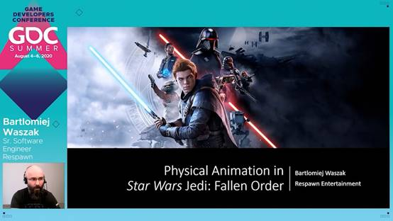

大家好，感谢各位的加入。
我的名字是Bartlomiej Waszak。
我是在Respawn工作的高级软件工程师。
在这次展示里我打算讨论一下，《星战：绝地陨落》中，在动画人物上应用物理效果的不同方法。
那么，究竟什么是物理动画？
物理动画代表我们不是单纯的播放一个动画，而是可以使用物理引擎驱动身体来逼近动画中的姿势。
这样做的后果之一是：应用物理引擎的时候，我们可以引入碰撞检测机制。
我们在播放动画的同一时间里可以检测碰撞防止穿模。

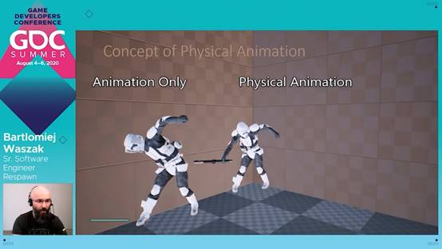

在这段视频里我们有两个播放相同动画的角色，左侧的角色只是在播放一般的动画。
但右侧第二个角色，我们在同样的动作里用了物理引擎。
我们能看到左边的角色会出现穿模，而右边的角色通过简单调整动画避免了碰撞。

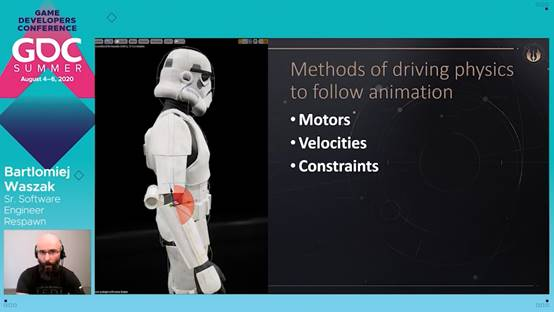

我们大体上有三种方法可以实现用物理驱动的方式来跟随动画：
第一种方法是使用发动机，发动机是常规身体部件之间的关节约束的一部分，
他们使用一种特定的动画目标来生成互连身体部件之间的局部驱动力。这种局部力会驱动身体来跟随特定的动画目标。
第二种方法是使用速度，在这个案例里，我们通过一定的帧时间来计算身体移动到某位置所需要的速度。
通过这种方法，我们可以用强制身体移动的方式来达到动画目标。
第三种方法则是使用约束，这里我们在布娃娃的动态身体和动画目标之间增加一个新约束，
这个新约束的全部参数定义了动态身体如何跟随动画目标。
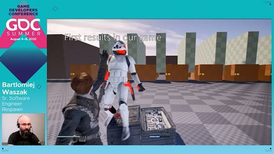

在我们的游戏里，我们最开始通过发动机来添加物理动画，所以这是我们要讲的第一个方法。
我们最初在风暴兵被主角原力牵引的时候加入了发动机，此时风暴兵的主干是纯几何的（kinematic），
这就是说，这部分是严格跟随动画的，但其他部分都是由发动机驱动的。
而这些红柱子...红色的物体代表纯动画里的姿势，就是说没加任何物理效果。
我们可以借此观察物理动画是如何让腿部的碰撞和环境的交互变得栩栩如生的。
这是种双向的交互，在没有任何物理效果的纯动画里，红色物体只会在碰撞时穿模。
我们的游戏用了虚幻引擎和Nvidia Physics的物理引擎，我想分享一些有关我们实现的根本细节。
首先，我们必须正确设置一些物理参数：
第一个参数是求解器的迭代次数，虚幻引擎发动机的默认值是8（位置）和1（速度），
但这个设置基本上是不能用的。在我们的游戏里，或者你创造自己的实现的时候，总的来说，你需要调高这些值，你得找到适合你的实现和需求的值。
我们找到的是64和32。
接着我们给所有关节启用了eACCELERATION标记，这让我们可以更轻松的设置参数，特别是和质量相关的参数。

此外还要讲一下摩擦和补偿，这些参数容易给物理动画带来很多问题，较高的摩擦数值会让物理动画难以达到动画目标，一般我们只会给摩擦和补偿使用较低的数值。
在这个原力牵引风暴兵的场景里，我们实际上完全没有设置摩擦，这是为了让物理动画更容易达到动画目标。
另一个有关实现细节的重要话题是连续的碰撞检测，你需要开启这个才能获得高质量的结果。但对同一个布娃娃上的身体部件来说，最好禁用连续碰撞检测。
整体上最大的问题是，你一旦开启连续碰撞检测，物理引擎约束里的投射就会出问题。
所以最后我们写了自己的代码来给所有关节做线性投射。
对每个关节，如果两部分离得太远了，超过了阈值，我们就把他们拉近一些。

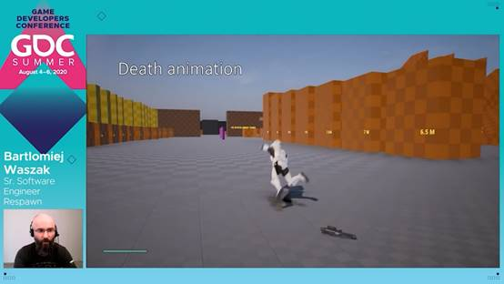

除了被牵引的风暴兵以外，游戏里另一个用了物理动画的场景是风暴兵的死亡场景。
这里我们只单纯播放了一个死亡动画，就像你看到的那样，动画出现了非常严重的穿模，其动作幅度本身就很大。这里面我们只在动画的最后一段启用了常规的物理引擎，以获得那种重力下自由落体的感觉。

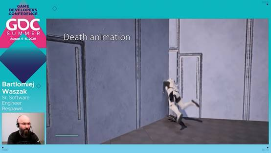

这个解决方案在开阔场景之下很有效，但遇上其他碰撞，就像我们看到的一样，效果并不是很好。四肢都碰撞穿模了，整体上也不是很自然。
为了改善这个死亡场景的动画序列，我们在整个角色身上开启了物理动画，我们给所有关节都启用了发动机，但主要的问题是：
如何处理根身体？

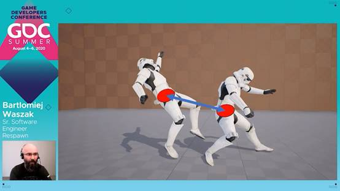
在这个例子里就是臀部。它不能设置成纯几何的，这样就和动画一致，它很容易就穿墙了。
但我们仍想要让根身体去严格跟随动画，做出那些夸张的翻转动作。
所以我们既需要碰撞，也需要根身体去跟随动画。
这个问题的解决方案是，让臀部处在物理模拟的状态下，同时给那部分创造一个新的约束。
这个约束作用于臀部和动画目标，算是会牵引臀部骨骼的物理形体去跟随动画目标。
为了实现这个约束，我们移除了所有自由度，锁定了直线上和角度上的运动变化。
这种设置最能匹配动画中的那些夸张的翻转。

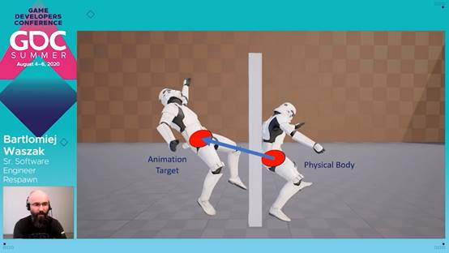

问题是，这个新的解决方案下，当我们有一个障碍物的时候，
就是说，如果臀部撞到墙上，但动画目标还在前进的话，
我们该怎么处理撞墙的物理形体？
我们的选择是检测根身体实际位置和动画目标的距离：
如果驱动臀部的约束没法跟上目标，达到一定阈值时，我们就将布娃娃变为自由落体模式。
看起来就是这样的。

这是用了物理动画的同一个动画序列。我们可以看到根身体是怎样判定撞墙，然后布娃娃进入自由落体模式的。这种方法在我们的案例里很有效。
在我们先前说过的这些场景里，重点是紧密匹配动画，同时支持碰撞，这就是我们游戏里风暴兵的案例。
但现在我想谈谈我们给主角做的物理动画。
事实上，我们后来发现“碰撞”其实不是很重要，自然动作富有变化的感觉和流畅度才是最重要的。

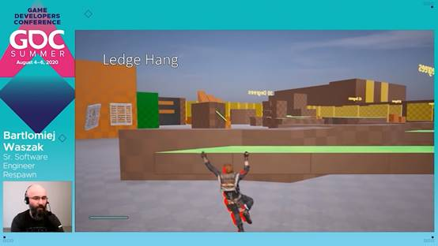

首先是主角沿边缘攀爬的场景，一种特殊的行进方式。
这里主角的手部和前臂是纯几何的，完全跟随动画目标。
其他所有身体部分都是纯发动机驱动的，纯物理的。
我们能清楚的看到纯动画的动作，红色物体更静态一些，而物理引擎给它加上了一层动感。
得益于此，动画设计师可以集中精力设计核心动作，再通过物理动画加上额外的变化。
这看上去很不错，这套设置给出了非常好的结果。只靠发动机来让物理引擎逼近动画动作的结果真的很不错。这种方法给运动带来了很多流畅的变化。

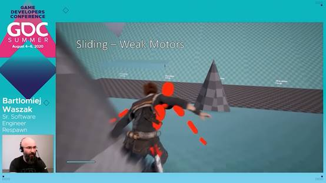

我们试着把同样的方法用到人类其他的移动方式上，但结果不是很好。
这里有一个弱模型设置的滑行场景，只要一遇到障碍物，或者有快速变化的运动，主角摇摆的幅度就都太过了。
我们试用了更强的发动机，这样一来角色又太僵硬了，无法令人满意。
我们也试了一些其他不同的方法，比如给所有身体部件加入了速度模型，但仍然无法显著的提高表现。
于是我们换了个思路，我们想出了一个不同的解决方案。
我们换回了弱发动机的设定，做出了那种弹性多变的表现。
新的解决方案是将其和动画动作进行局部的空间混合。
在这个滑行场景里，我们对物理动作只设置了50%的混合。
这就是最终结果，他看上去真的很不错，特别是那种，额，你用摇杆控制主角的时候，角色会以非常美妙的方式回应你的移动。
这并不那么僵硬，同时摇摆的幅度也不是很剧烈。

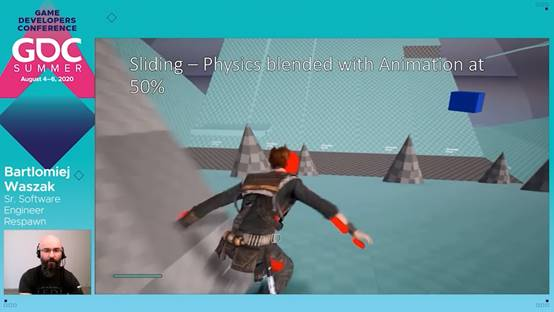

在游戏成品里，它看上去是这样的。

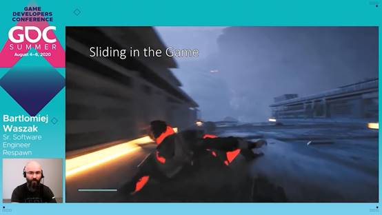
我们给主角准备了不同的动作，
额，
但这整个动作序列真的...额，
物理动画，给移动方向的改变，和发生的所有碰撞，带来了更多变化和反应。
有了这个新思路之后，我们试着把它用在其他场景里。

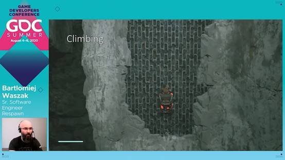

这里的攀爬场景，我们只混合了40%，最后的结果有些微妙，不过动作整体确实变得更自然多变了。
这里展示是的有风场的场合，我们给物理引擎和动画目标做了45%的混合。
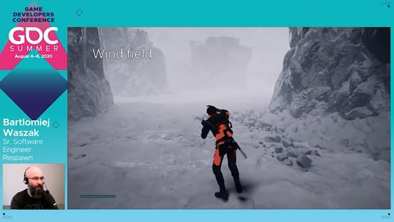
还有爬绳的案例，我们做了40%的物理混合。

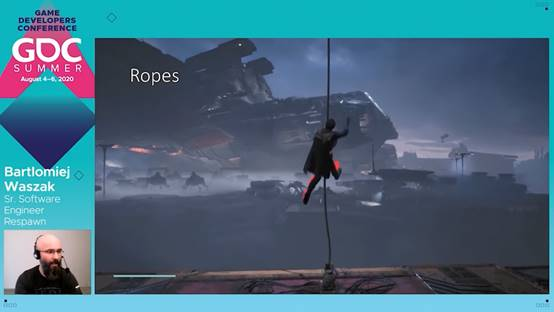

所以我们可以看到停止运动之后，腿部自然生动的惯性，还有主角有的那种额外的动作。
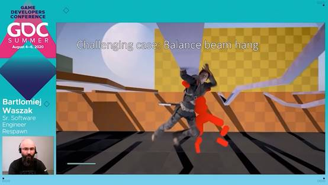
在这之后我们又遇到了一个挑战性的场景：平衡木悬挂。
把它做对是非常有挑战性的，正如你看到的，设置50%物理混合的时候，我们很难给这个场景找到稳定的动作。这是因为这里角色有非常激进的动作，角色摇的太过了，最后的整个位置都和动画偏离的太多了。
所以我们换了一种方法
我们选择了一个身体部分，以给他加上速度驱动的方式来稳定整个动作。
这是我们实现的代码，我们首先计算想要的直线速度。
就是说想，要把身体从当前位置移到动画目标地点所需的帧内速度。
之后我们读取身体的直线速度，然后我们在当前速度和第一行算出来的目标速度之间做一个线性插值。
这就是我们选择的方式，我们把当前的速度、物理视角下的当前的状态输入给身体部件，让它达到所和动画动作一致所需要的速度。
变量T定义了物理混合的程度，平衡木场景下，我们给臀部身体部件混合了50%的速度驱动。
这是该解决方案的结果。
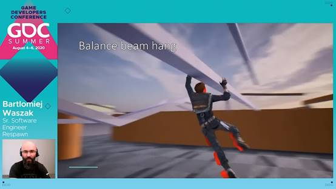

给臀部身体部件，加上局部速度驱动的方式，很好地平衡了整个运动，同时没有影响其他身体部件的表现。
我们算是留住了其他纯发动机驱动的关节的生动表现，但也没让运动摇摆的幅度过高。
我们可以看到，整体上，角色对运动的反应是多么优美。
这些先前的案例，都是在强化主角处在一些特殊运动方式下时状态，但地面步行的情形又是怎样的呢？
我们试着处理了主角地面上正常的走跑动作，但没找到什么优化跑步或走步动作的机会。
只有运动的开始和转向看上去是有希望尝试一下我们的新技术的。
这里是演示视频，我们把重点放在了主角的手臂上，整体来讲，止步、转向物理动画的开始涉及到了更复杂的逻辑。每一个物理动画都会持续两秒，并在这段时间里完成过度。

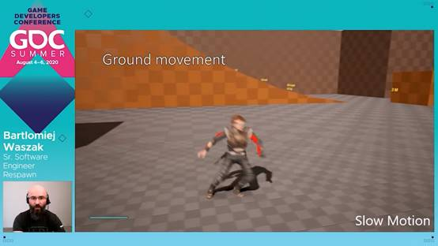

和我们在视频上看到的一样，物理动画带来的是一种难以察觉的影响，但它让不同动画之间的转换变得更加顺和，也给动作加入了一些惯性。这里我们只融合了40%的物理就取得了非常好的效果。
我们可以看到有时手臂和红色物体之间有延迟，就是和动画目标之间有延迟，或者过一会，它像是有额外的惯性，有点，有那么点超前于动画目标。
所以说这种技术真的给整个运动带来一种漂亮的小优化，物理性的优化，然而在有些场景下，偶然的，物理引擎的动作会和动画目标的动作相差太远。
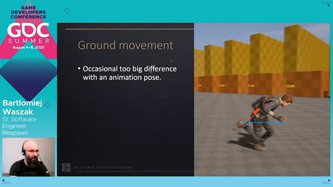
我们不想加入额外的速度驱动，因为它会改变发动机的整体表现，我们最后想出来一种新方法，我们再一次加入了一个新的约束。
这次的约束处在手腕身体部件和动画目标之间，这一约束允许自由的角度运动，但是给直线运动加上了距离限制，在我们这里是在10和5个单位之间。
这就是说手臂在一定范围内是可以自由移动的，具体来说，直线运动限制是25个单位，角度运动则没有限制。
所以如果动作和目标里的太远，这个约束就会将动作拉近动画目标。
如果是在范围限制之内，手臂是可以如愿自由运动的。
加上那个限制之后，就像图片上显示的一样，手臂离的就不像左侧图片上一样那么远了，所以它真的给了我们所需要的结果。

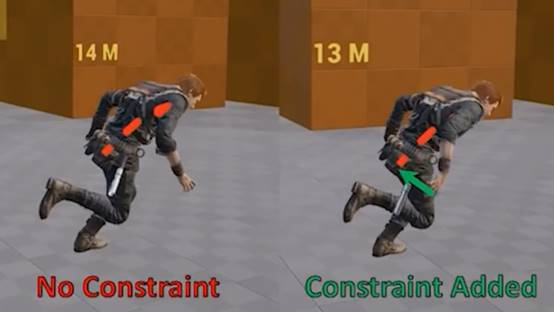

在主角走平衡木的时候，我们也在主角的手臂上用了差不多的方法来模拟物理，在这个场景里，这个方法给出了一种非常好的软性感觉，能反射平衡木上的谨慎运动，这个方法在这里很有效。

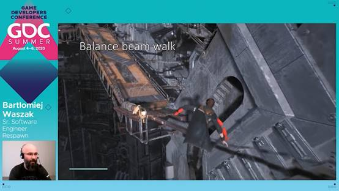
我们游戏中第三个应用了物理动画的大场景是伙伴机器人BD-1。
这是个同伴机器人，大部分时间都抓在主角的后背上。
我们想给它加上一种“放松”的物理动画，来让机器人对主角的动作能做出自然的反应
这是它在游戏里的样子。

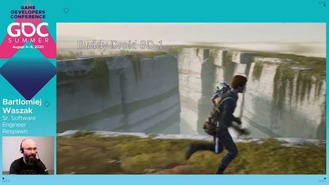

机器人腿的底部组件是纯几何的，其他所有部分都有完全的物理效果。
而且这里没有动画混合，所以这是百分百的物理效果，而且没有给任何关节加上角度限制。
我们可以看到机器人带有额外惯性、自然的动作，能在回应主角各种行动或者步行中的动作。
滑行的时候，这点表现得特别明显，机器人会很好的和主角一起摇摆，这里的表现真的很好。

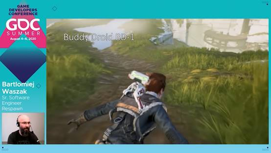
然而对主角一些高速的动作，我们在支持机器人的物理效果上遇到了一些困难，物理动画在这样的场合下会变得不稳定。
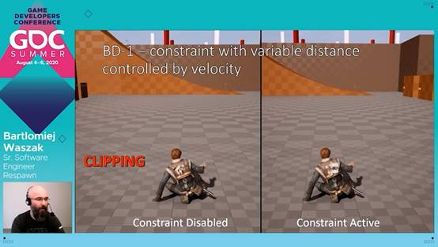

所以我们得想办法限制机器人的动作，于是又一次，我们添加了一个新的约束。
不过这次是在机器人的头和动画目标之间添加约束，只是这次我们会动态的调整距离限制的阈值。
这就是说如果身体移动的速度较慢，这一阈值就会变大，机器人可以做出更加自由的动作，但如果身体移动过快，为保证头部和动画目标相，这一距离就会趋于0。
在超高速状态下，距离严格为0的时候，我们实际上直接把约束模式从“限制”改成了“锁定”，这样就有了最严格的监管。
这看起来是这样的。

对这个主角来说，额，这样的高速动作，额，我们在左边展示了一个对比组，上面没有加任何约束。
我们可以看到机器人的头，短时间内整个穿过了主角的模型，就是这，而在右边，开启机器人头部约束的情况，我们可以看到它很好的留在了该在的地方，而且机器人也保留住了低速下的物理表现。
我们没有真的去改变低速状态下的表现，但只要高速运动一发生，机器人就有可能穿模，或者变得不稳定。这个约束以将距离阈值几乎限制为0的方式，来让机器人的头处在该在的地方，也就是动画目标所在的地方。
整体来讲，实现机器人的物理动画真的是很有挑战性的，有不少原因在里面。
在机器人抓在主角身上的时候，我们对它用了85%的缩放。
在这种自定义缩放的情况下工作，真的不是很令人愉快。
我们在执行的顺序上也遇到了问题，我们有可能在机器人使用物理的同时也在主角身上开启了物理效果。
事实上，滑行行进的场景就是这样的，主角和机器人身上都有物理动画。
这种条件下，找到妥当的执行顺序真的很有挑战性。

我们还遇到了另一个问题。
机器人的物理动画在可变帧时间的时候，看上去会有点不一样。
30fps的时候，我们有看上去不错的结果，但60fps的时候，表现却非常僵硬。
全部这些设置让实现这个机器人变得非常有挑战性。
于是我们想出了这些解决办法：
在我们的游戏里，每个不需要碰撞的物理动画，比如机器人的例子和主角的跑步时的很多场景，都是运行在自己的物理场景里的。
物理场景无视硬件差距，是在固定的帧时间内模拟的。
我们给剩下的时间加上了预测的动作，来更好地模拟。
因为我们有这种独立的物理场景，我们可以控制他们开始模拟的时间。
于是我们先在主角身上开启物理动画，有了结果之后再准备一下，开启机器人的物理动画。
这就是《星战：绝地陨落》里物理动画的第三个大案例了。

我想总结一下我之前说的。
嗯，我描述了一些集成物理引擎的重要细节，比如迭代的次数，摩擦和补偿，加了约束投射的连续碰撞检测。
我也介绍了使用约束驱动常规根身体，臀部部件的方法，这是有关风暴兵的案例。
如果那个根身体和动画目标之间的分离度达到一定的阈值，我们就把整个布娃娃交变成自由落体模式。
我们也在纯动画和发动机驱动的身体部件之间，用了很多的局部空间混合。
事实上，我们倾向于用弱发动机设定来取得那总富有变化的表现。
在其他场景里我们也给单一个身体部件用了部分的速度驱动，来稳定运动。
我们还用在常规身体和动画目标之间添加新约束的方式来实现一些动作限制。
主角地面行进时手腕骨骼的案例就是这样的。
机器人的头也是如此。
机器人的头的案例里，我们也根据头部移动速度来动态的改变运动限制，也说了一些实现细节。
正确的实现这种物理效果也是很重要的，为此我们给抓在主角身上的机器人使用了各自独立的物理场景，这样我们可以更好的控制物理动画序列。

这里还有一些，我希望我开始研究物理动画之前就知道的东西。
额，开始的时候，你应该知道，额，这是很有挑战性的，但你应该知道你在游戏里加入物理动画的目标是什么。
你是想在播放动画的同时支持物理碰撞？
还是说你想改变一些运动的视觉结果？
因为这个两个例子要求不太一样的结果办法，不一样的设置，用到了物理动画不一样的特性，各种物理参数也都不同。他们互相影响，你改了一个参数，它就会导致别的什么东西变得更好或者更烂了。
而且你需要回顾之前失败的案例，从始至终，你需要在之前的案例上测试你的新知识，来看看新方法究竟能否带来提升。还有，当你有激活的布娃娃物理的时候，注意！它基本一直都是激活的，有些一般会起效的东西会有点失效。
比如你更新活跃实体组建的顺序、
一些物理引擎和其他系统之间的依赖关系，比如布料系统在某些场合应该放在物理系统后面、
还有动画通知。
这些东西，当你没有一直开启物理引擎的时候，他们都会正常起效，但你开启物理引擎，还和其它系统有很多依赖关系的时候，要让他们起效，你必须要小心处理这些东西。
我想提一下两个主题差不多的先前的展示，一个是GDC2017的《神秘海域4中的物理动画》，一个是GDC2018的《EA所用的物理驱动布娃娃和动画》。你可以看看这些优秀的展示，来看看其他实现的细节，看看他们是怎么给他们的角色启用物理的。
此外，我们Respawn在招人，请看看我们的网站：www.respawn.com/careers
我非常推荐你来浏览一下。
Respawn一直都在招人,所以请看看有什么你感兴趣的吧。
嗯，谢谢大家，有什么问题都请问。

# 译后
游戏开发, 很难吧?
果然?
那当然!
