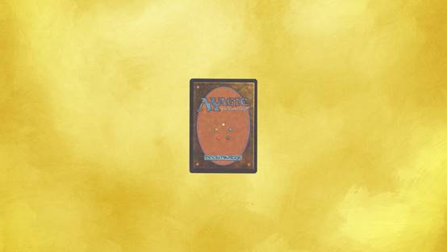

一瞥《万智牌》卡牌的背面，你会找到另一个时代的遗产，一种图像设计和古典幻想美学融合而成的化石。
这是整个游戏历史中唯一一个没有改变的图像：层次丰富的正面没几年就会被抹掉重做，但卡的背面一直是那张1993年华盛顿对巫师魔法书的想象的快照。
壳环的中央是《万智牌》系统中也许最精巧的元素：这五个原点好比音阶的八个音符、拉丁字母表的五个元音和二十一个辅音。
这是指导游戏核心理念的五色魔法能量。
他们构成了一个完美的五边形，通常被称为“派”和“轮”。
就像五度圈一样，每一个颜色彼此之间都有一种联系。
但和五度圈不同的是，合奏中的每个音符也有他自己的本质。
白、蓝、黑、红、绿，所有颜色都是由其内涵和游戏伊始时卡牌最初的几次迭代共同定义的。

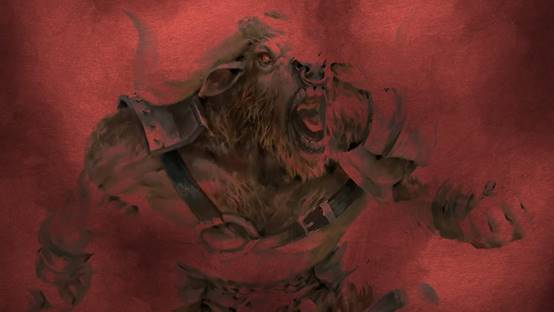

红色，举个例子，是热情的颜色。
红色保有愤怒和主动性，一种欣然以及焦急。
每个颜色典例的根基都深入人心。
简单来说，这个游戏的成功是和“不同颜色该行不同之事”的思想交错盘联的。
白色应有自己的强处和黑色可以利用、蓝色可以补足的弱点。
这是因为颜色的安排不是随意的：每个颜色都有两个邻居和两个对面。
用《万智牌》术语来说，临近颜色被称为盟友，而轮盘对面颜色被视为敌人。
早期《万智牌》的设计较好的实施了这个概念。
但直到2005年，颜色的盟友和敌人这一概念才完全成型，并给游戏的未来打下了基础的框架。
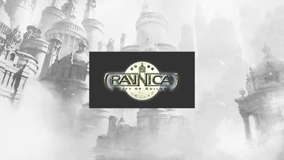
《拉尼卡工会城》对游戏研究和发展的最大贡献是作为系列代表的十个二色派系。
引用Rosewater的话，“拉尼卡提供了理解颜色派的新方法，化为10部分而不是5个。”
这些公会翻倍了可用的设计空间，还事实上翻新了卡背上传承了12年的的技术水平。
这就好像是将和声和旋律结合起来。
拉尼卡在那之后就成为那个真正意义上在乎派别的万智牌世界。
一个派别（Faction），在《万智牌》的语境下，必须占有一个艺术创造上和游戏机制上的身份。
派别必须可以被分为各组，并且可以和具有不同的艺术机制身份的其他派别区分开。
按照颜色分类其实并不是完成这一步目的的唯一方法，比如你还可以做生物部落，但就《万智牌》的情况而言，这一方案是最优雅的。
仅次于拉尼卡的方案，举个例子，是鞑契。鞑契将颜色派按三色楔形分类，用上了所有拉尼卡工会的设计原则来构建了五个部落。
阿拉若也把颜色派三个一组分类，不过其派别不是靠颜色分组，而是按照世界划分的。
提到这些，我是想说这些卡片背后的小环是《万智牌》创造的最成功的那批IP中的一个的巅峰。
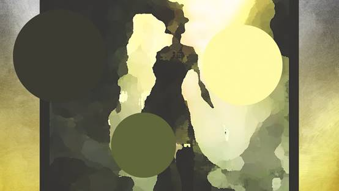
正因如此，我想从颜色的角度来考察一下拉尼卡，即从指导了游戏设计的理论意义上出发，也从字面意义上，在画布上铺展开的绘画的颜色出发。
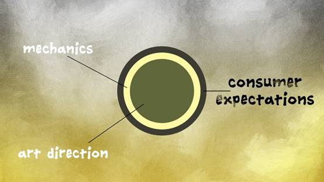
我对“艺术方向和游戏机制是如何互相影响的”、“如何同样被悠久的消费者期待推动”这两点很感兴趣。
我想解开拉尼卡独有的怪异悖论，即：“你如何从彼此之间分清10个颜色对，又同时提供一个共通元素来把他们固定在一个世界？”

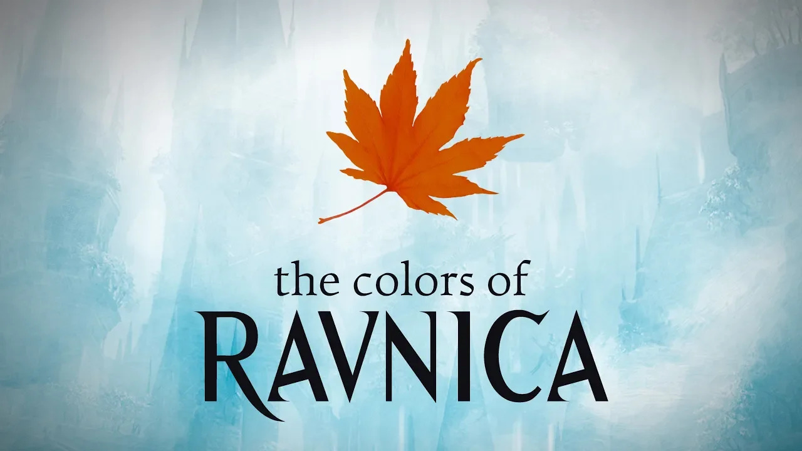

#  拉尼卡的颜色
[source](https://www.youtube.com/watch?v=thFpB_aD6nY)

    “在《万智牌》里，想在老东西上加上新东西的高难度远近皆知，因为你要对抗怀旧感，对吧？
    你必须，在一开始的时候，就告诉自己你是打不赢怀旧感的。那是不可能的。”

这段话的发言人是Titus Lunter，一个为《万智牌》工作的知名画师，
他曾是《拉尼卡峰会城》的概念推动组（Concept Push）的一员。
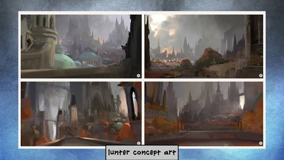

    “所以你需要做的，是从另一个角度来处理它。你必须无比的忠于这个位面，但你不必去弄清楚这个位面的每一个角落。
    你必须要弄清楚的是这个位面对玩家的意义。
    所以对我来说，更重要的是弄清楚拉尼卡对玩家意味着什么、玩家又是怎样体验拉尼卡的，而不是执着于这个位面的技术性细节。”

Titus和他的概念设计师同事面对的一个挑战是捕捉拉尼卡那萤火一样的精髓。
和一般看法相反，回归已有的世界进行创造要比创造新世界要难很多，这一现象的部分原因是怀旧感，当你回到一个拉尼卡一般深受喜爱的世界时更是如此。
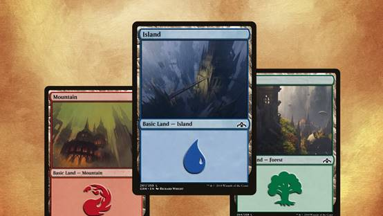
身为都市世界（Ecumenopolis，一种完全由城市组成的世界），拉尼卡第二个最与众不同的特点是建筑物、窗户和鹅卵石街道无处不在。
用叙事设计师Alison Luhr的话来说，

    “拉尼卡是一个以布拉格为原型的城市世界。其受到10个不同的公会管辖（每个都监督着魔法都市生活的不同方面），
    一个远古的魔法协议让他们彼此间不能公开交战，而这带来了水面之下的种种诡计。”
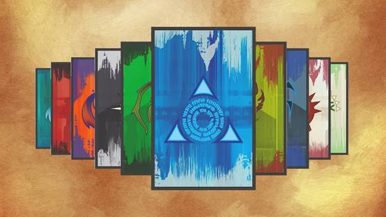
比起文艺复兴时代的欧洲风格，公会本身就是拉尼卡身份的中心。
在这座城市，这些派别可以找到他们的自我表达的最高级形态，而在某种意义上，他们的行为也是这种极端前提决定的。
我想说的是：葛加理就应该栖居在下水系统并负责回收利用所有都市居民产生的废品，只有这样才说的通。
只有在城市里，俄佐立的警察才能行使他们关乎秩序和正义的严苛教条，也只有在城市里，军队才能时而担当起公民防御职责，时而作为武装警卫存在。
在某种达尔文主义的意义上，是环境塑造了公会的形态，并在结果上塑造了带领他们的玩家的性格。

如果说拉尼卡给《万智牌》带来的最大财富只是这些派系营销上的优势，那就未免有些太不负责了。
作家Rob Bockman对这一系统进行了漂亮的批评，点明了拉尼卡的“测测你的公会”和“相信星座”、“哈利波特分院测试”的相似之处。
这种性质的人格分类让我们从细微差别的个人主义里走出来，选择了建立玩家间的相同支点。
再次借用Bockman的话，拉尼卡的公会满足了人类的两种被营销利用的冲动：情感吸引力和对熟悉感的追求。
在你选择一个工会的时候，你同时也流露出了很多你身为一个人和玩家的信息，不过是以一种抽象和相对性的方式。
这些颜色对永远没法完全代表他们最忠实的成员，而且毫无疑问，我们每个人都会有感觉更欧佐夫一点的时候，也有更析米克一点的时候。
但这是这个世界最有趣的部分，也是《万智牌》粉丝频频回访这里的原因。

《拉尼卡峰会城》的预发布是有史以来最成功的，而这是理所当然的。
这是让《万智牌》和我们之间的距离拉近一半以上的世界，一个总比其他世界感觉更像是家的世界。
正是因为这样，Titus Lunter和概念团队知道他们可以依靠对城市的怀旧感和对公会的熟悉感来重塑这个世界。
他们没有回避这种怀旧，而是选择将其以一种叙事手段来接纳。
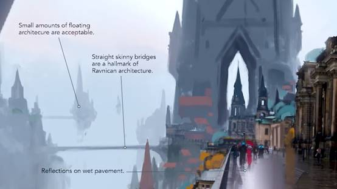
拉尼卡现在是秋季：落叶飞舞，街道被午后的冷雨打湿，若隐若现的冬天迹象开始在市民中煽动起无端的担忧。
有什么糟糕的东西要来了：天气已经为后日的破坏设置了阴谋。

    “如果你进一步推动已经和非常极端颜色，就是说伊捷的亮红和蓝色，
    或者平原阵容的亮天蓝色和黄色，相联系的拉尼卡。
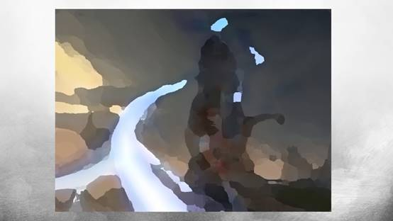

    如果你开始将其推动到更静态的颜色板，那种依尼翠所在的更暗的黑暗，你要如何区分这两个位面？
    所以我们要做的第一件事就是弄清楚如何从艺术设计的角度区分不同的位面。
    前景，中景以及背景，天空和大地的联系。如果你要将一副图像简化为绝对的基础元素，且只能使用三种颜色和三种形状，那你会为拉尼卡选择什么？
    首先，考虑到秋季和雨天，天空中要有灰色：这我们知道了。
    建筑应该是什么样的？我们应该有一种压迫感。
    这就是说从艺术的角度来看，天空和建筑的颜色关系和明暗关系应该是非常接近的。
    如果你让这两者之间出现了较大的反差，他们就会失去一体感。
    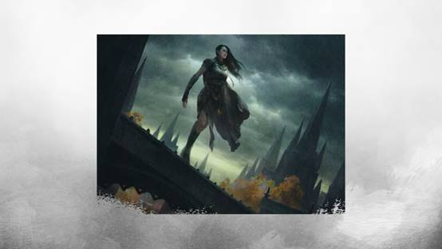
    我们把建筑的颜色朝稍微更黑暗的方向推动了一下，因为这样一来，他们就有了种令人忧虑的压迫感。
    我开始将天空看作是朋友。现在正在下雨，但它有的是更温暖的一种灰色。
    这不是夏天般的温暖，但也不是冬天那样冷酷的灰色。所以我们正处在这中间的位置，而且我们很享受这场雨。
    我们不喜欢的是建筑和官僚主义的压迫感。

    所以我们把建筑推向了更冷的范围。这就是为什么很多屋顶都从红色改成了蓝色。”

 拉尼卡正处在冷战之中。公会已经习惯了这种冲突，但创意团队想把这种感受从这些常客那传递到我们这里。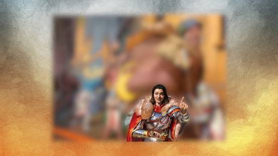
这就是“全城拘捕”在卡面和背景叙述里打破第四面墙的原因。

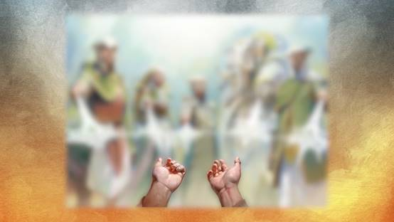
来自《核心系列2019》的“孤立”以及《拉尼卡峰会城》的“盟会裁定”也想让我们和被压迫者相联系。
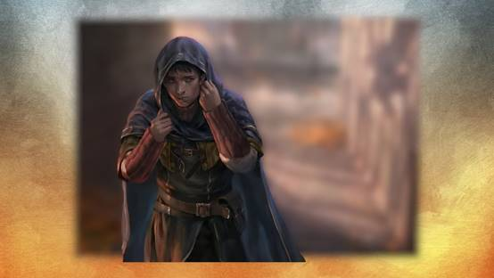
“寒意蔓延”也做了类似的事情：我们可以感受到转角处的危险。
影子指明了即刻的危险，但地上的落叶和斗篷下忧郁的脸都暗示了更糟的东西存在的迹象。

《万智牌》玩家已经习惯了新位面亮相的系列带来的戏剧化开场，但现在家被外界力量威胁的感觉让赌注更大了一些。
将拉尼卡设定在秋天是为了迎合开两个主要目标：邀请画家切换调色板，配合已经建立的视觉象征重新想象一个世界。
同时也要伸展到卡片之外，和北半球民众在日常中目睹的变化相合。

要做到这一点，应该用和其他娱乐媒体一样的方式来给玩家和游戏建立联系：我们倾向于在10月份看恐怖片，在一年末尾时惬意的享受圣诞经典。
考虑到我们已经两次访问过拉尼卡了，而且两次都是秋天，游戏正将现在和过去联系起来。
如果你在《重返拉尼卡》时期进行游戏，或者从系列亮相的时候就开始玩，你或许会开始比较这段时间里你人生的种种变化。
事实上，只要在类似的时间回到熟悉的位面，《万智牌》就可以养成属于它自己的怀旧感。

就个人而言，我很欣赏这位面上季节的变化。
仔细研究目前介绍过的公会，我们可以惊喜的看到各对颜色里的元素集表达秋天的方式。
我们可以在生活中花上一整天在城市大门附近漫步，观察季节是如何向我们展露它的颜色的。
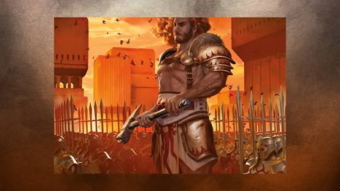
波洛斯被描绘在黄金时刻，升起或下沉的太阳的光芒让所有人都看起来处在巅峰。
这是一天中最转瞬即逝的时间，对在乎快速行动的公会来说是一种完美景象。
波洛斯拥有红白两色，所以粉色和橙色装点了他们的装甲和饰物。
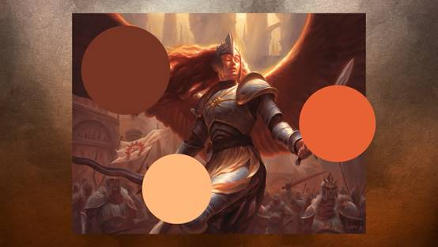
他们闪闪发光，有种正义性的气质，而太阳则处在他们图像的最中央。
“所以对波洛斯而言，他们的建筑其实有一些小变化，建筑上现在有了更多的金属装饰，这是我们决定要追求的方向。
虽然从概念的角度讲，波洛斯已经定义的相当完善了，但建筑商还有很多发挥的空间。
我们知道他们的几何形状，但装饰是否有些许不同呢？是的，因为他们算是拥有了更坚硬的边缘。”
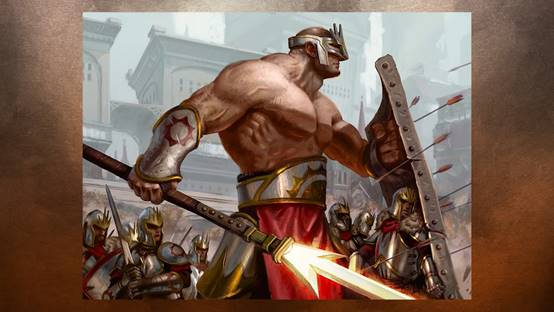
视觉上来讲，波洛斯并没有多少魔法元素。
他们反而选择炫耀起武器和装甲。他们是士兵和骑士，不是巫师，他们在街道上的形象很有重量感，就仿佛是这些材料的重量把他们留在那里了一般。

瑟雷尼亚则是在白天漫步拉尼卡的另外一个公会。
唯一的区别是此时太阳正高悬于天空。
它明亮耀眼，充满希望。瑟雷尼亚代表着城市中自然世界的纯净表达。
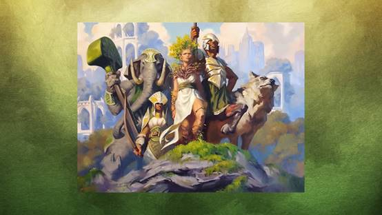
Sidharth Chaturvedi所绘的“同袍情谊”是瑟雷尼亚的画作典范。
注意光照是如何把面部表情从中心人物凸现出来的。
淡蓝色、大气的背景和丰富的绿色互补，而白色的服装和绒毛让这幅画作保持平衡。
青苔、岩石还有树木是这个公会中最常出现的元素，人物周遭的景色里有，生物自身的着装上也有。
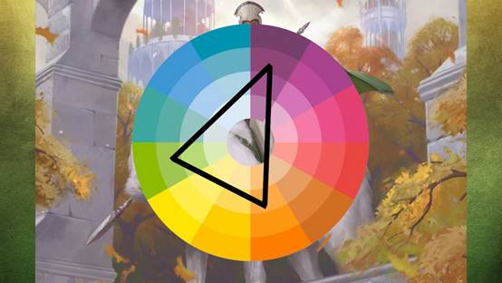
橙色也同样出现在瑟雷尼亚里，给他们的调色盘带来了活力。
考虑到绿色和橙色是一个色环三角中的两个角，“半人马调停人”和“盟会骑兵”卡面上的树叶在它们的环境中显得十分突出。
美国观众会把这类色调和感恩节、玉米片和对丰收的庆祝联系起来。
瑟雷尼亚在温度下降的情况下培育了温暖。
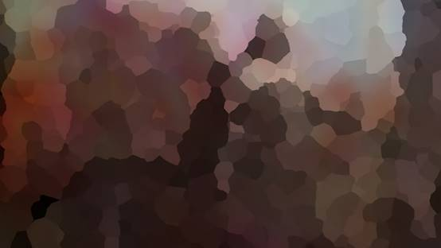
这个公会的一个异类是Nils Hamm所画的“玫瑰鬃半人马”。
半人马的秋季色调很好利用了一阵冷风带来的伤感，而且和有“什么邪恶的东西即将到来”的场景设置非常吻合。

    “我叫Ryan Pancoast，我是个自由画师。我主要为《万智牌》工作。我以传统的方式绘画，以油彩为主，我已经有10年经验了。”

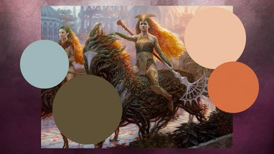
“暮秋骑士”是本系列里另外一个杰出的插画，我想稍微深入一下Ryan的创作过程。

    “在选择颜色的时候，我有在尝试找到一个关键颜色来给整个画作打下基础。所以我知道秋天的颜色是非常重要的。
    所以，在基本上意识到这点之后，我着重强调了她的头发。所以她的头发是亮橙色的，在这之后的全部都是基于它的。
    我知道我想在她的后方留下一个云开日出的景色，就好像雨已经离开了，太阳渐渐露出，在整个景色上铺开一片薄雾。
    但我仍希望留下颜色的全域：我不希望阳光盖过其他颜色。”

Ryan也提到了他先前的作品“好斗树灵”来讲解骑士身后的士兵。
这里的马主要由树枝和嫩叶构成，而橙色又一次给这张画带来了一种飘渺的质感。
它给这组哨兵一种推力，好像在动员他们加入战斗。
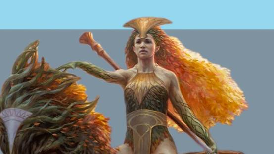
对Ryan来说，准确掌握这种色调是很重要的，他要避免了整个调色板被单一颜色盖过。

    “于是我拿来了她头发所用的橙色，仔细审查了一下，然后想到‘唔，要有多蓝的背景才能让它显得蓝呢？’
    事实证明，背景并不需要变得多蓝就可以让发色呈现出蓝色的感觉。我经常会做出这类判断。
    我经常选择一个颜色，然后把它作为其他一切的中心。
    于是最后我没有把完全的蓝色和完全的橙色放在一起。我用那独一个颜色调和了一切。

拉尼卡的其他三个公会不会在白天出来。
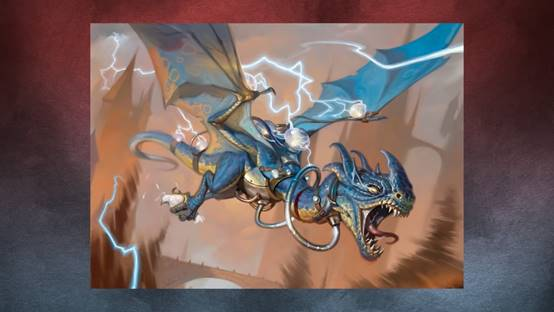
伊捷只在他们制造的雷暴中现身。
他们的天空回应了Titus Lunter稍早的评论：满是混乱的温暖灰色。
伊捷视角下的拉尼卡有种被污染和霓虹般的质感，像是除夕夜的时代广场或者《银翼杀手》里的洛杉矶。
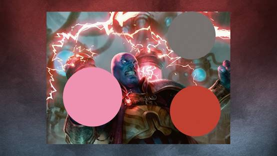
高饱和的粉色击打在电光的蓝色之上，让这些卡片微微震动。
伊捷的爆炸是一触即发的，满是粒子的空气允许画家在画面整体上填满狂乱的能量。
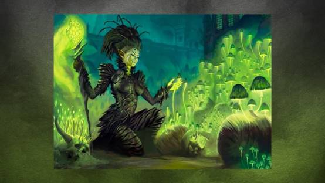

在这混乱之下潜伏着葛加理群落。
他们是被抛弃者，司掌腐朽的王族。
那种人造的，几乎是化学般的绿色出现在他们的一些卡片上：那些生长在城市废物的蘑菇正辐射出这种光芒。
葛加理是被憎恶者，被拒绝者，是天黑后在小巷和杂草丛生的停车场里打棒球长大的坚韧孩子。
如果秋天是一个恐怖电影，那我们已经找到了里面的怪物，当地下世界的野兽来到地表作乐，他们会夺下一切。

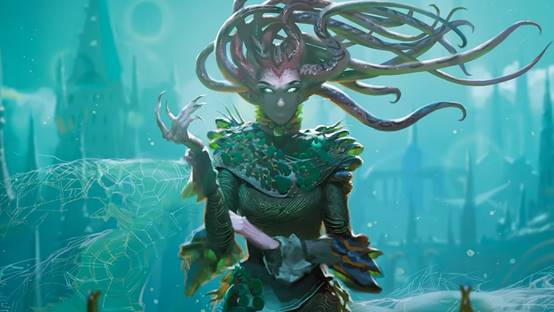

月亮照耀着戈尔贡的头发，但一切都染上了些许海蓝色的微光。
葛加理是被忽略者，于是在他们的着装和姿态上，他们表明了自我。

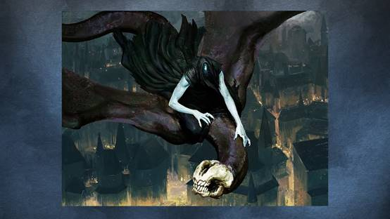

拉尼卡在改变，这一系列的所有公会里，第五公会迎来了最大的机制和视觉上的翻新。
曾被称作是不存在的公会的底密尔已经被完全改造了。
他们是可见的，然而止对我们--游戏的观察者，如此。在Mike Linneman的观点里，底密尔是奇幻版的黑**。
卡面一遍又一遍记录下他们实施犯罪前的身姿，不管是暗杀还是背叛之前。
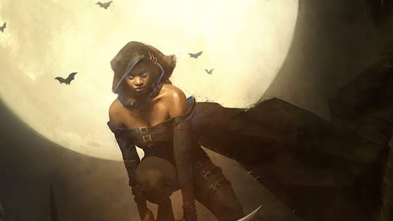

他们潜伏在夜晚，在满月的黄光之下。
深沉的蓝紫色凸显出他们皮革般的斗篷和浮动的披肩。
在秋天，太阳落下的越来越早。我们在室内的时间开始变长。
我们变得有那么点更内向，更倾于反思自我。我们摘下白天工作时必须佩戴的面具，把他们换成我们对自己本身的理解。
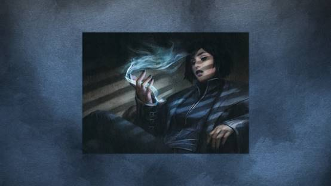

底密尔为城里夜晚着装打扮，带上了首杯鸡尾酒第一口赋予的恶魔般的能量。
他们是夜的守望者，秘密的守护者。
就这样，五个公会就像是五角形的颜色上彼此独立。
他们存在与一个虚幻的世界，一个利落的分为10个整齐派系的城市。

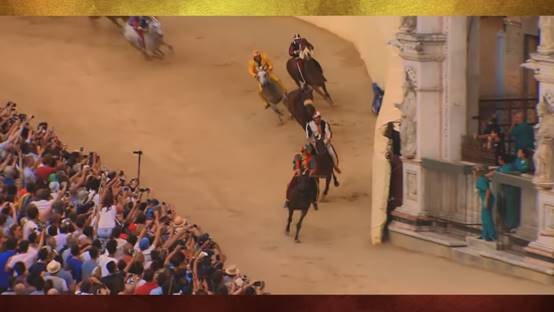

在意大利，一年两次，Siena的市民会集结于所在社区的旗帜。
他们各自选出马匹和骑手来在鹅卵石广场竞速，时常产出一些断腿事故和满是瘀伤的骑手。
比赛的胜利者会成为他们社区的冠军，同时也就成了Siena的冠军。
马也会在大教堂得到歌颂。这是个大事。

拉尼卡的诗意所在是在每次迭代之后，它和家之间缩短的距离。
这个表现了政治纷争的紧迫感、敌对仇杀、废物管理的问题
以及很多其他伴随着市中心生活的结症的奇幻世界和我们的距离并不是那么遥远。
回到我最主要的问题：是什么让公会间彼此不同，又让他们成为一个统一整体的一部分？

最终答案是城市的特性本身。就像我们不能一次体验到完整的拉尼卡，
而被迫通过一系列静态的图像、不连续的角度、对遥远尖塔的一瞥和各种区域来想象它，
无法通过地图和三位数字导游来具体掌握它一样，我们同样无法一次体验我们所在的城市的整体。

我们反而生活在它们之中，成为一个生活在繁忙、费解且令人紧张的钢铁丛林和噪声间的市民。

有时，我们珍惜公正、秩序、法律和自然的价值。
我们在夜间前往音乐会和咖啡馆，并和周围舞者的节奏同步。
我们坐在城市公园里，一边观望日落一边品尝葡萄、投掷飞盘。
我们抚摸爱犬，投喂看门的猫。
每一次造访，城市都显得不尽相同。
时间推移，我们察觉到气温的下降，心里滋生了一种焦虑。
我们向过去的自我寻求指引。
在无法解答的问题迷雾之中，我们选择在色轮和卡牌游戏身上寻求基础。
今天，我是红蓝两色的。

用Calvino的话来说，“城市就像梦境，是希望与畏惧建成的，
她的故事线索是隐含的，组合规律是荒谬的，景观是骗人的，
并且每件事物中都隐藏了其他的什么。”

# 译后
鸣谢: atr