    爱
    在你发现整个世界都味同空气清新剂时 是美丽的 所以你要握住爱
    握紧 永远都不要松手
    ----死侍

# 《星战:旧共和国武士》中的爱之哲学

在任何讨论艺术的社区花上一段时间之后 任何人都会
开始拥有自己最喜欢的角色

《星球大战》也不例外
这一系列建立在无数的故事之上 贯通电影 游戏 电视剧 漫画等多种媒介
在所有这些角色之中
一个倍受喜爱的角色是Jolie Bindo
一个出自《星战：旧共和国武士》的绝地
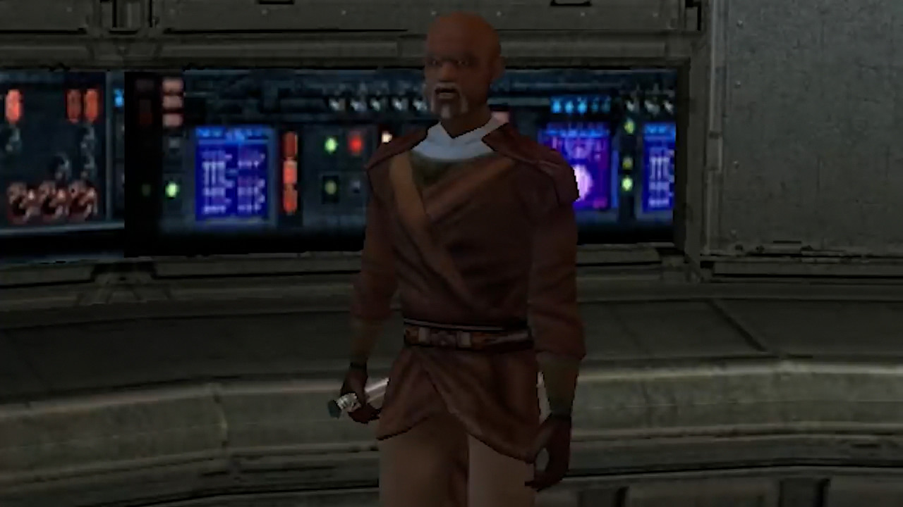

只看表象的话 是这个老人风趣的谈吐让他成为了最受欢迎的星战角色之一
然而
在考察他受欢迎的原因时 人们会发现 主要原因不是他的性格 而是他的哲学

不幸的是
人们对Jolie的喜爱源于对该角色所代表的含义
以及他的人生感悟是怎样与整个星战背景设定相悖 的误解

人们之所以喜爱Jolie 总的来说是因为他的人情味
和绝地西斯相比 他展现出了一些人本主义的特点
Jolie称他自己是一个历经沧桑的睿智老者 作为生活在星战宇宙的原力敏感者

这让他拒绝绝地和西斯的理念 成为了另一种选择

在伍基人的星球Kashyyyk遇见他后
Jolie会加入队伍
主角可以通过在飞船上与其对话来了解他的人生经历
Jolie会提供一些道德经验 批评绝地武士团的教导
在这些批评之中
最让人共鸣的是他关于爱的演说

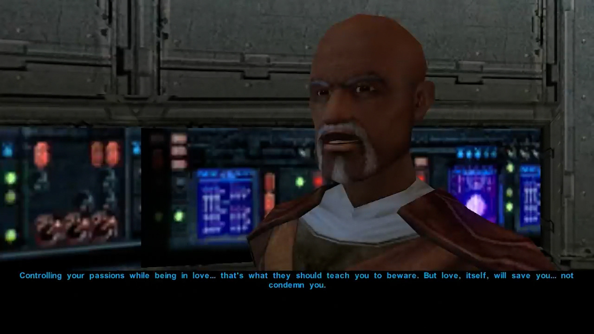
    绝地们 这帮凡事都畏首畏尾的家伙 会主张避免爱 但只要还有一点生机 任何人都知道这是错的 爱不会将你拉向黑暗面
    热情会导致怒火和恐惧
    且可以被控制
    但是热情和爱不是一回事 在爱的当下控制你的热情 这才是他们该告诉你的东西 但爱本身会拯救你
    不会令你受难 爱自然会导致痛苦
    爱会不可避免地带给你 与喜悦等量的悲伤和悔恨 如何对待爱不好的部分 会决定你的人格
    会决定黑暗面对你的掌控
    没有风险的人生是无趣的 如果你想要爱 你就要为之奋斗

一个绝地和西斯共同点是 两边都不会真正的去爱
绝地不容许男女之爱 只允许面对众生的无条件之爱
西斯是如此的沉迷在追求力量的道路上 以至于从未将爱纳入过考虑
就算有例外 他们在获得力量的过程中 也将不可避免地失去他们的爱人
与两种想法不同
Jolie说出了去爱并为止奋斗的感受
一种绝地和西斯明显缺少的东西

对所有人类来说
爱是一种生来就有的 强烈的亲密情感关系

这一关系包含内心深处对伴侣的强烈重视 以及对与之共同度过的生活的喜爱
一般来说 这是一种基于他们的身份和他们对你的重要性的 更深的人际关系

然而
不仅仅是对爱之伟大的布教
让Jolie在星战情景中变得重要的 是他关于 “爱不会
令你受难” 的宣言
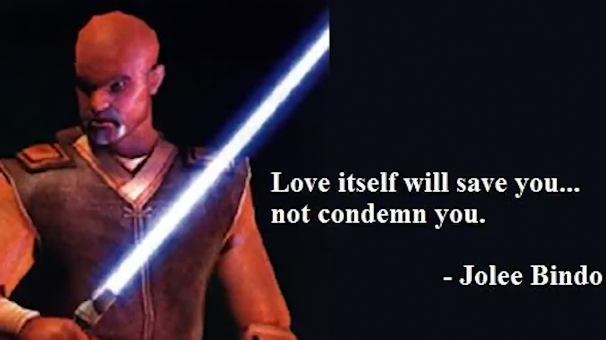

从元叙事的角度来说
这一宣言是一个关于整个星战背景的观点
Jolie认为爱不会滋生堕落
是热情让原力敏感者堕落到了黑暗面
绝地过度小心 拒绝与人建立联系的做法是错误的

游戏没有止步于把他的观点当作潜在的可能性
而是展现出了其在某种程度上的正确性
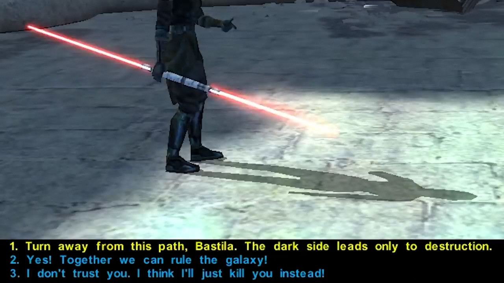

如果玩家角色性别为男 在游戏临近终局之时选择光明面路线 并于Bastila建立浪漫关系
Jolie的话就会被证实
你可以用爱的力量从黑暗面中唤回Bastila
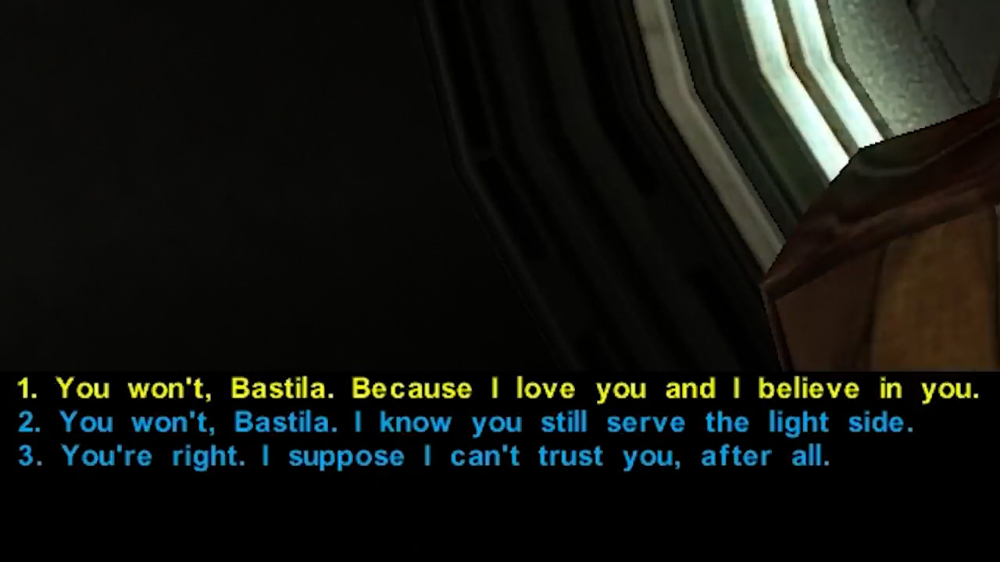

问题是这与星战的结构相悖
甚至与《旧共和国武士》本身的故事也是相悖的

如果玩家选择一个女性角色 就可以和Carth建立浪漫
但在选择光暗结局之时
他们可以选择黑暗面结局
Carth会数次尝试将你从这一邪恶之路上挽回
就像玩家男性角色在光明结局路线中对Bastila所做的一样
然而这并没有奏效
游戏以你摧毁了共和国结束
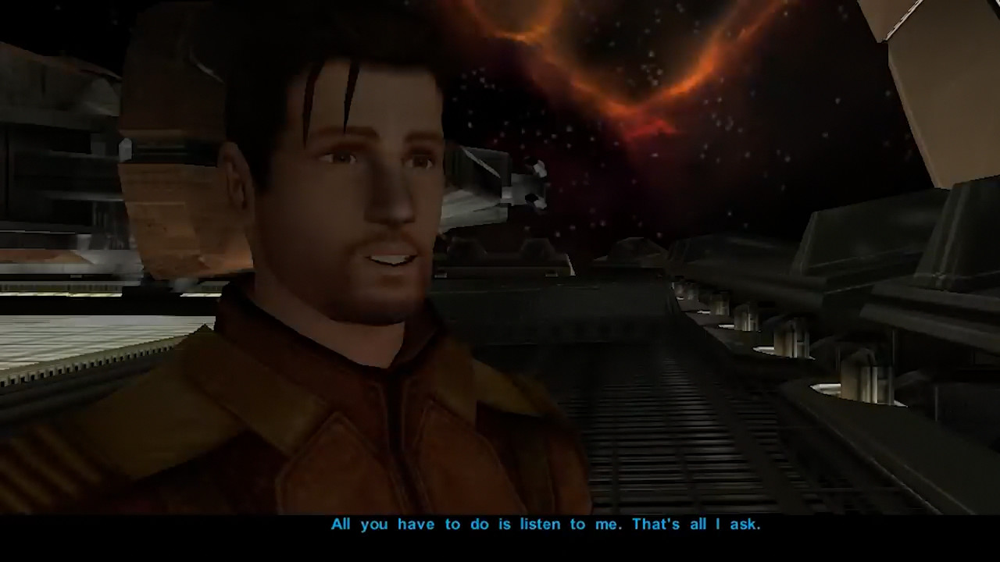

Carth最后还会劝你弃暗投明
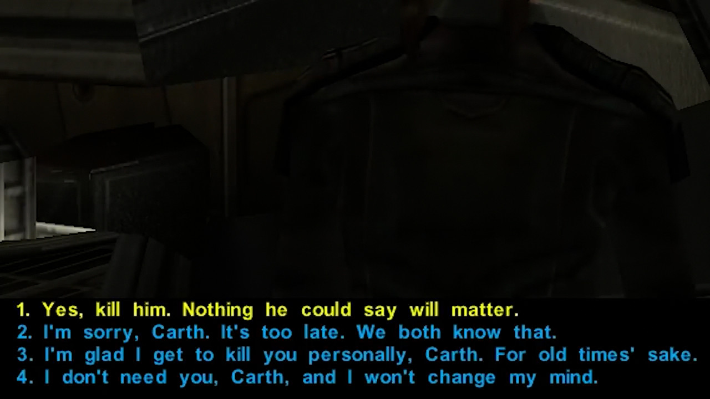

但你唯一的对话选项就是杀了他
在这条路线中
爱没有拯救任何人

更糟的是 爱会拯救人 的观点甚至和Jolie自己的经历相抵触
如果你和Jolie对话 他会说出自己在过去的冒险中
遇见了一个有很优秀原力素质的女性
与她相爱 并秘密的训练她
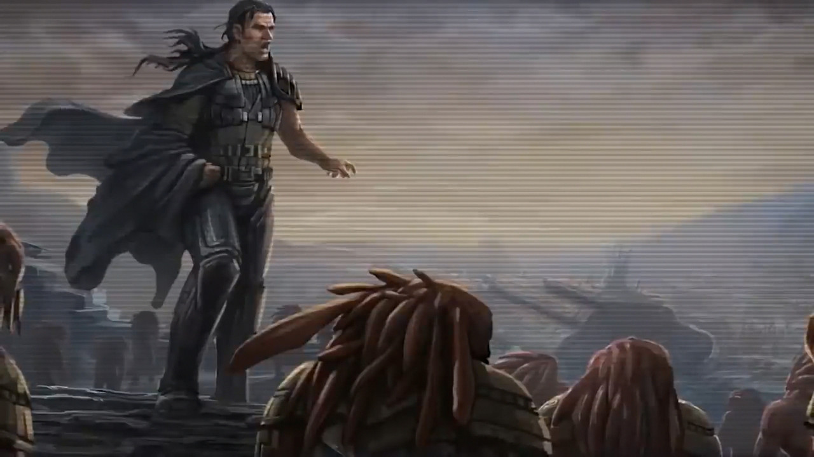

但她被Exar Kun有关绝地伟大未来的承诺说动 投向了黑暗面
在Jolie拒绝了她的邀请之后 她和Jolie开始了战斗
Jolie击败了她
但因为Jolie对她强烈的爱
他没法下杀手
然而再强烈的爱也无法将她从黑暗面中拉回来

虽然《旧共和国武士》想提出相反的观点
但在星战中 爱确实没法拯救任何人
并且事实上不断让原力敏感者们承受苦难
《西斯的复仇》中有最明显的例子

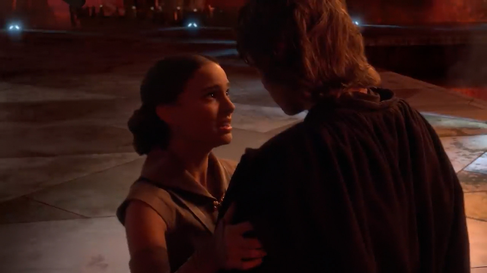
Padmé恳求Anakin回到征途
这没能拯救Anakin
而Anakin最终下手杀掉了她
人们能引用到的唯一的反例

就是在《绝地归来》的最后 Luke 对他父亲的爱看上去拯救了他
但人们常会忘记 卢克从未和父亲建立过一种积极的依恋关系

所以Luke感受到的 并不是对个人的爱 而是无条件的爱
在《星球大战》中
无条件的爱不代表对某人怀有极强的爱慕之心 以至于愿意为他们做任何事
而是代表对众生的爱
平等的
没有直接的人际关系

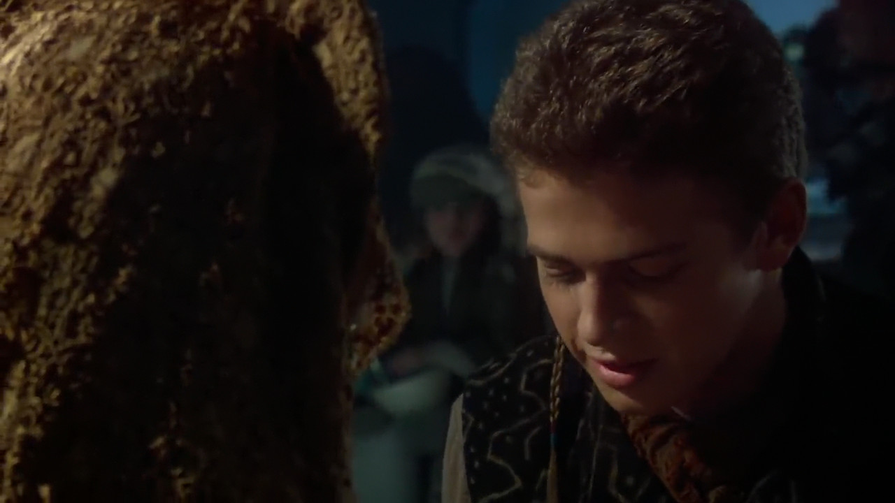
    依恋
    不得拥有
    财产 不得拥有
    恻隐之心
    我将之定义为无条件的爱
    对绝地的生活至关重要

因此
星战中有两种爱
建立在个人联系 伴侣本身 和对你的重要性之上的爱
或者
无私的恻隐之爱 不加区分的爱所有生命

Luke与他的姐姐 朋友 抱有依恋
因此害怕失去他们
这几乎让他堕入了黑暗面

但当他放下仇恨 用无私的恻隐之爱面对他的父亲时
Anakin以自我牺牲的方式回应了他的恻隐之爱
拯救了他的儿子和其他人

在表面上来看 好像是个体与个体间的联系拯救了世界
Luke和父亲之间的联系拯救了他

但Lucas强调 是出于无私和恻隐之心的 对自我生命的放弃 拯救了银河系
在《The Making of Star Wars：Revenge of The Sith》里 Lucas说

    这真的和学习相关
    孩子们能教会你恻隐之心
    他们教你如何无条件的去爱
    Anakin 在造成那些痛苦和磨难之后 没法被救赎
    他不能拨乱反正
    但他能停止这种恐怖
    传奇的结局 其实就是Anakin在说 我爱这个人 无关他对我的意义
    我会放弃掉我的全部
    放弃掉我爱上的所有东西 --主要是皇帝 以及我自己的生命 来救这个人
    我这么做的原因 是因为他对我拥有信念
    在我做过那么多恐怖之事后 仍然爱我
    我伤害了他母亲的心 但他仍然在乎我 而我不能让这消失
    Anakin在最后的时候是非常不同的
    事情是 预言是正确的
    Anakin确实是天选之人 而他确实给原力带来了平衡
    他榨出了身体中最后一丝美德 出于对儿子的恻隐之心 摧毁了皇帝

这种对恻隐之爱的强调 是绝地禁止建立联系的教导的核心 因为这种联系会让个体变得贪婪 并带来对失去的恐惧

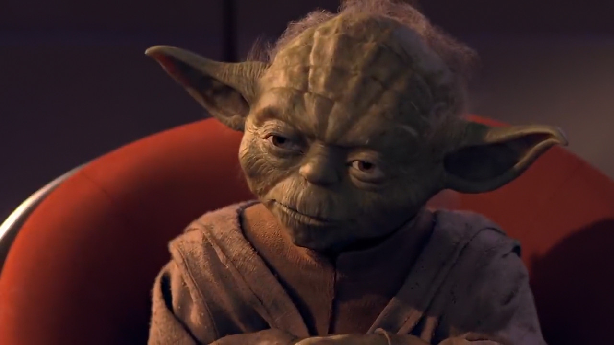
    -你心中所想的是你的母亲
    -我很想她
    -你害怕失去她 我想
    -这有什么关系
    -一切
    恐惧是通往黑暗面之路
    -那他会接受训练吧
    -不
    -他不会接受训练
    他年龄太大了

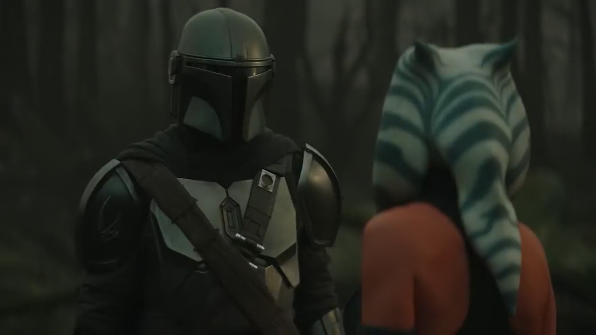
    -他对你建立了很强的联系
    他没法接受训练
    -什么 为什么
    -他对你的联系让他变得易受恐惧 愤怒的影响
    -这听上去像是更多训练他的理由
    -我看过这种感情会将训练有素的绝地引向什么道路
    最顶尖的绝地也不能幸免
    我不会把这个孩子送上那条路

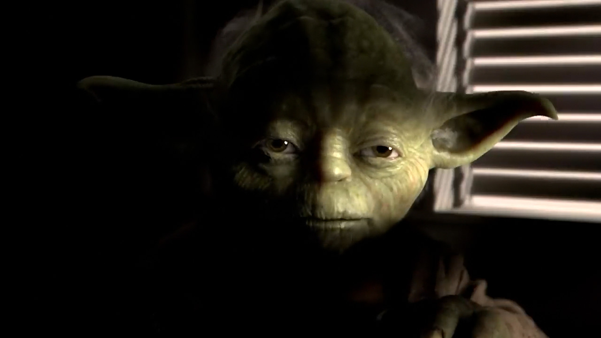
    联系带来嫉妒
    贪婪的暗影 那是

很多人认为绝地的教导是错误的
持有和Jolie相似的观点
认为绝地应该教会人们控制自己的热情 而不是直接拒绝爱

但这远比那要深
绝地不许建立联系的教导是 回避对力量的渴求的手段 是为了他们自己好
在《The Making of Star Wars：Revenge of The Sith》里 Lucas解释道

    “没有人能放下” 

Lucas对Yoda和Anakin的这一场景如此评论

    这很难
    最后我们终将放下 因为这不可避免
    你会死亡 失去你所爱的人
    但在你活着的时候 你不能执着于留住这些
    因为这种执着 和贪婪同类 是贪婪的导火索
    而这就是西斯的本质
    西斯绝对的痴迷于获得更多的力量
    但为了什么呢
    什么都不为
    除了对“更多”的痴迷

人类天性的本质
是和他人互动 在与其他人的联系之中有自己的偏好 而不是对所有生命抱有恻隐之爱

对这种带来愉悦的联系的执着 一直被视作是让人走上邪恶之路的隐患 事实也是如此
这迫使绝地武士团谨小慎微地 通过在幼年训练敏感者的方式 来阻止他们建立联系
又是在《The Making of Star Wars：Revenge of The Sith》里 Lucas说

    “绝地的训练目标是 能够放下”
    “他们一出生就接受训练” 

他接着说

    “他们不应该建立联系”
    “他们可以爱别人 事实上他们应该爱所有人”
    “爱他们的敌人”
    “爱西斯”
    “但他们不能建立联系”
    这些电影的主题都是
    贪婪
    贪婪对所有人来说都是痛苦之源
    而最终极的贪婪 就是永生

这就是为什么 “放下” 是星战的主题
原力敏感者生来就具有力量 因此必须无私
他们必须放下他们的联系 并对众生抱有恻隐之心 以便他们永远不会滥用力量
给Jolie招来悲剧的是 他像所有人一样 生来就知道爱的价值
他亲历过爱
但就算他极度希望 爱在星战银河系中不会令你受难

它确实会

虽然他有关拥抱爱的讲话
看上去给出了绝地西斯之外的第三解
Jolie的人生选择却与自己的哲学相违背
在打败Exar Kun之后 他得知了妻子的死讯
Jolie被武士团审判 但被宽恕了所有的罪过
他觉得自己被背叛了 厌恶 无论自己到哪里 人们都为了私立利用他 这一事实
Jolie决定在Kashyyyk做一个隐士 长达二十年之久
懦弱地成为了一个冷漠的绝地

这几年来 很多人都反对给Jolie打上冷漠或者懦弱之类的标签
他有台词解释说 他有在帮助迷失于Shadowlands的伍基人
然而
这些渺小的善举 在面对Czerka Corporation奴役全部伍基人的恶行 却无动于衷这一点面前 显得是如此的苍白

你可以问他为什么不帮助伍基人
Jolie会闪烁其词
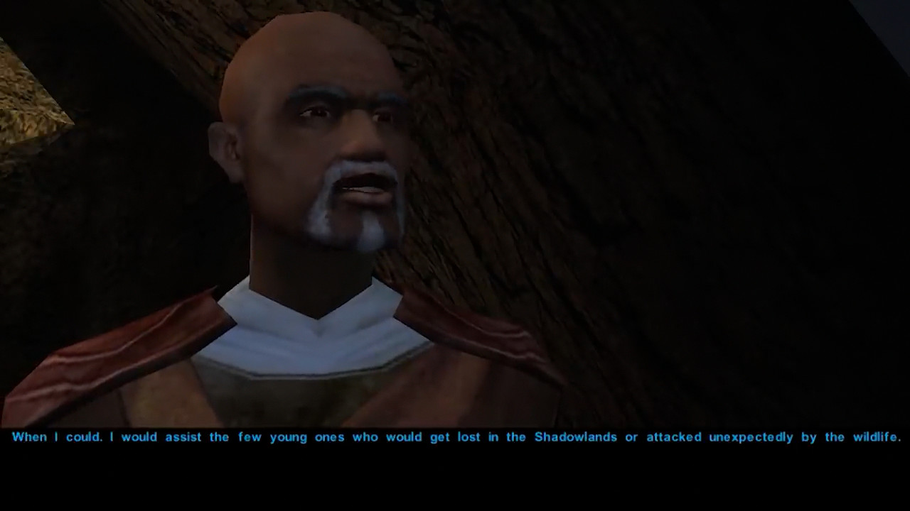
如果你接着问他 为什么不用他的力量称王
Jolie仍会闪烁其词
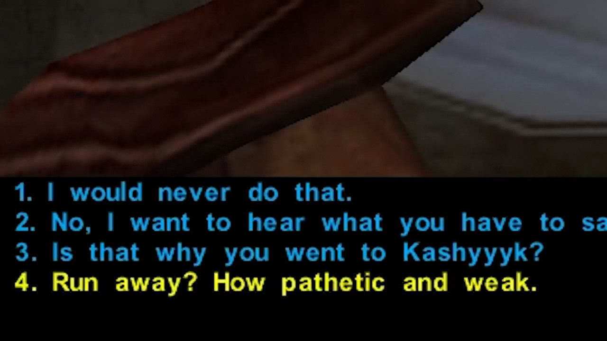
如果你进一步逼问他 选择直接称他为懦夫的选项 他的立场就会很明显了
如果你真的这么做的 他就会接受“懦夫”的称呼

虽然Jolie有非常人本主义的信念
但他拒绝和生命建立有意义的联系
他代而选择一种未必比死亡更好的生活方式

从特定的观点来看 在绝地和西斯两个选项之间
冷漠的或者也许是更好的选择
如果生为原力敏感者就好像进入了一场**纵的游戏
游戏里你要么选择无私 不带任何个人联系地持有恻隐之爱

要么感受人性 冒着腐朽原力 堕落到黑暗面的风险经历短暂的私心
也许Jolie变得冷漠的决定是正确的选择

不幸的是
它不是
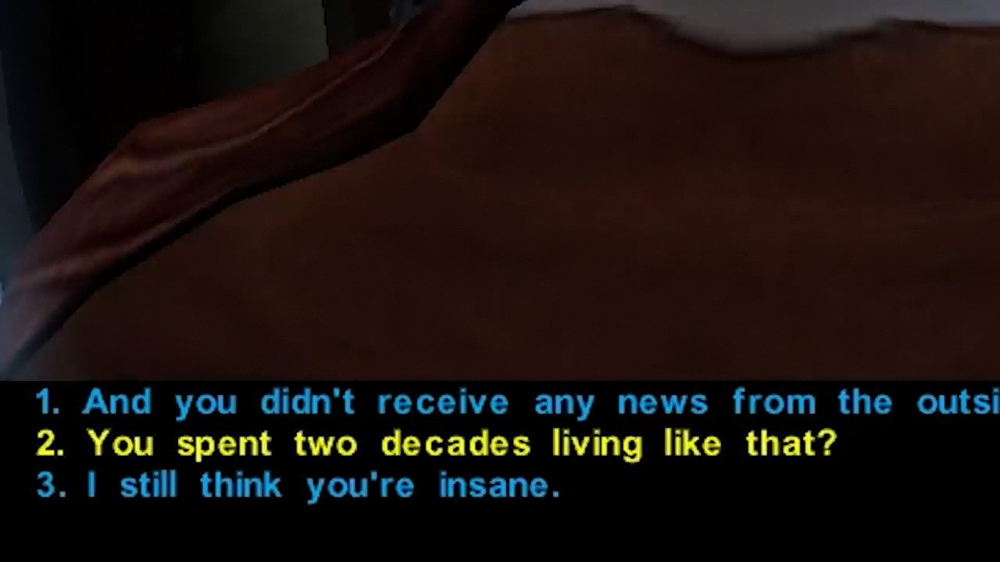

因为冷漠就等于死亡
Jolie浪费了人生中的二十年来做一个隐士
活得如同石头一般
等待死亡
为什么?

虽然Jolie从来没解释过
有关放任伍基人自生自灭的言论暗示了 他不想让原力影响到伍基人
他不想承担使用原力的责任 因为这会带来不可见的后果 一旦误用 更将腐朽自身

从他的角度来讲
他没有选择
他生来就是原力敏感者

能使用原力是一种诅咒 让人遭受永远无法过正常生活 或者感受长期的爱的磨难
对Jolie来说 冷漠的活着是让他能保持自我的唯一备选项

根本上来说 Jolie明白绝地和西斯的缺陷
绝地必须为全银河的福祉成为非人
而西斯是永不放手的产物

同时
他意识到人对联系和爱的需求
而这是值得奋斗的

但却没能意识到 让敏感者们无法成为真正的人并经理爱情的 正是他们自己对原力本身的依恋
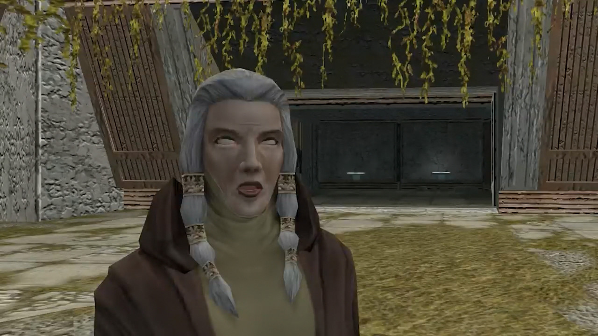

在《旧共和国武士2》中
Kreia批评了绝地大师Zez-Kai Ell的冷漠
也间接批评了Jolie拒绝放下原力的i行为

    还有Zez-Kai Ell 藏在Nar Shaddaa 却对那里发生的一切充耳不闻
    离理解原力如此之近
    离放弃原力如此之近

Jolie也许离开绝地武士团
但他仍然背负着不建立任何联系的责任
为此 他选择了冷漠的人生
他和他所批评的绝地一样 是非人
也和他们经历同样的痛苦
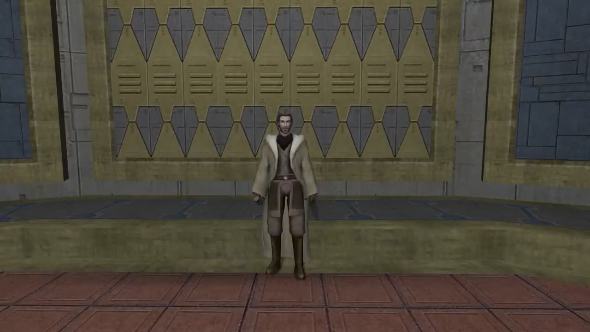

这种痛苦体现了《旧共和国武士2》中流放者的重要性
他们是《星球大战》中 唯一放下了原力的角色
如此完全
如此彻底

以至于他们选择了无需与原力建立联系的生活方式 并拥有了爱人的自由

这是正确的选择 也是绝地和西斯之外真正的第三条路
Jolie的悲剧就是他从没想通这一点
也因此根本上的 没有在妻子死后 真诚的生活的机会
如果爱真的如Jolie宣称的那般值得奋斗
那放弃原力来追求快乐也是值得的
很重要的一点是 Jolie关于爱值得奋斗的说法是正确的
人们因此喜欢他也是没错的

但在《星球大战》的宇宙之中
因为原力的性质和黑暗面的风险
绝地禁止联系的做法也无疑是正确的

Jolie Bindo的流行不只是因为他的人本主义的教导和对绝地哲学批评
他是Kreia思想的先驱 意识到了绝地和西斯的思想都是非人且缺爱的
但他没能意识到的是 他们的哲学只存在于他们选择的形态之中
因为这一切都只基于原力摧毁人类天性的事实

而就这点来说 星战本身的设定
就是邪恶的
因为它主张爱会令人受难 将他们引向毁灭

    -《星球大战》电影中经常会出现学徒和导师

    你觉得我们该给步入成年的孩子们传递什么样的信息
    -最核心的东西是 在谈到宗教的时候 所有宗教说的都是一个东西
    基本上就是
    爱是宇宙的秘密 就是说恻隐之心 就是说爱他人 照顾他人 互相帮助
    这就是全部了 说到底这不是很难
    这践行起来很难 但知道不难 意识到每个预言 每个宗教信仰都以此为主题这点 不难
    原力 星战里的宗教 基于全部的宗教 而不是单一的某个
    《星球大战》中的苦难是关于热情和恻隐之心的
    是贪婪对抗放下, 放弃
    基本上就是这样
    整个问题就是 贪婪的另一面就是对失去的恐惧
    所以你要么想要拿到某些东西 要么害怕失去已经到手的东西
    而这个思想是要放下这些东西

    回顾历史 审视源于东方的道德学说
    他们说的都是牺牲个人的喜悦
    在那些复杂的教诲之下 他们都有同一个主题
    牺牲
    克己和自我否定
    你听不到他们的主题曲吗？
    放手~ 放手~ 放手~

