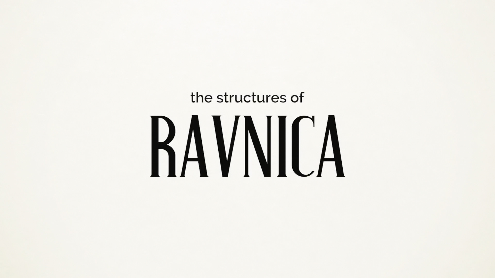
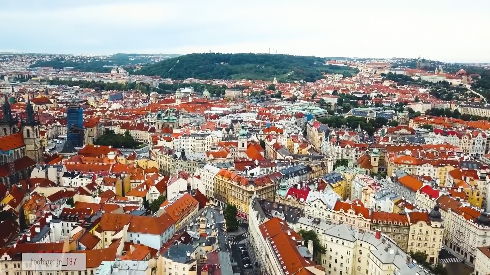
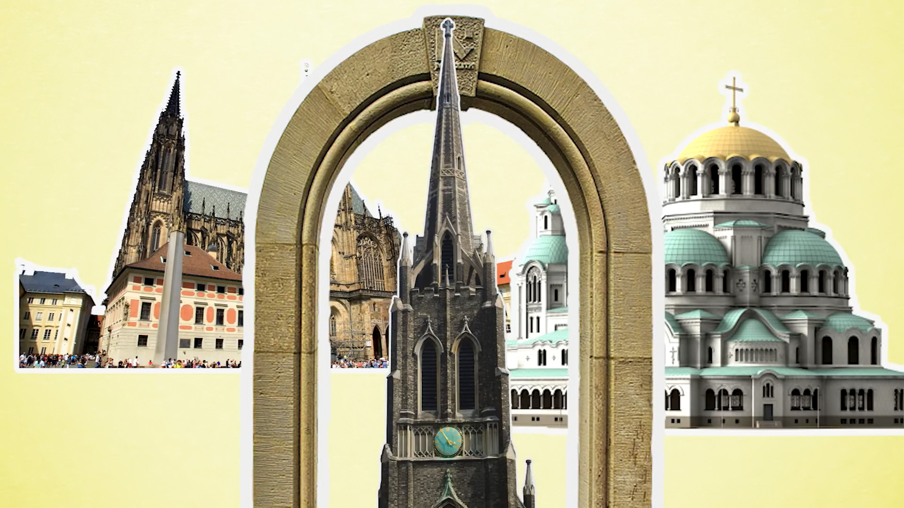
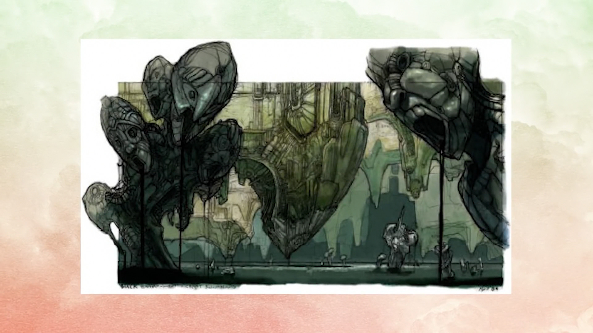
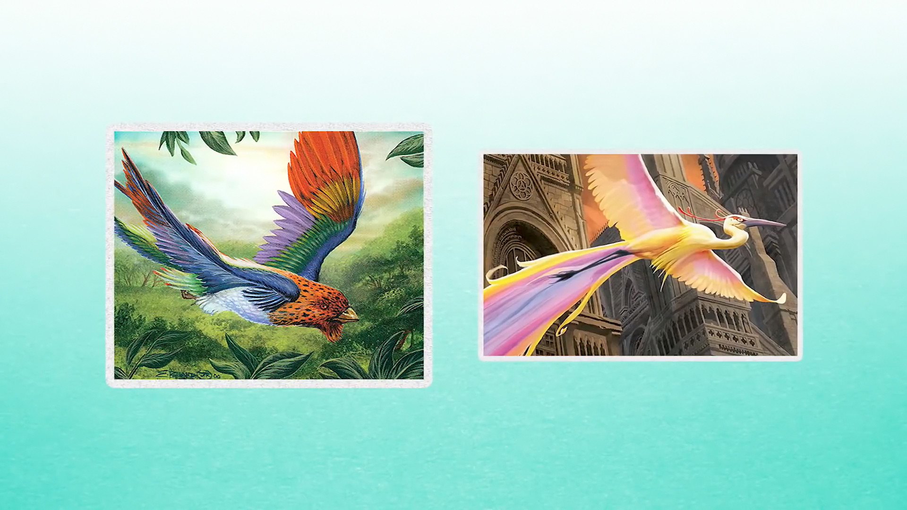
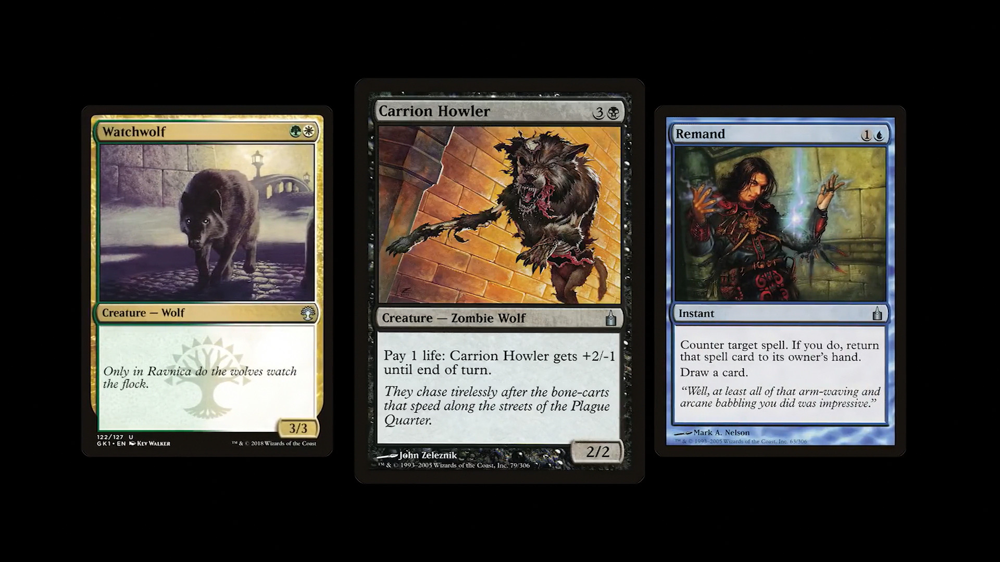
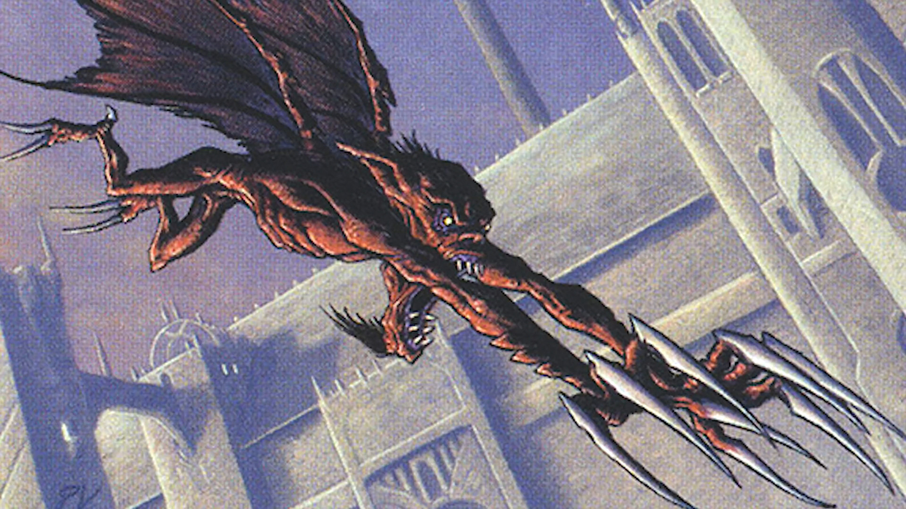
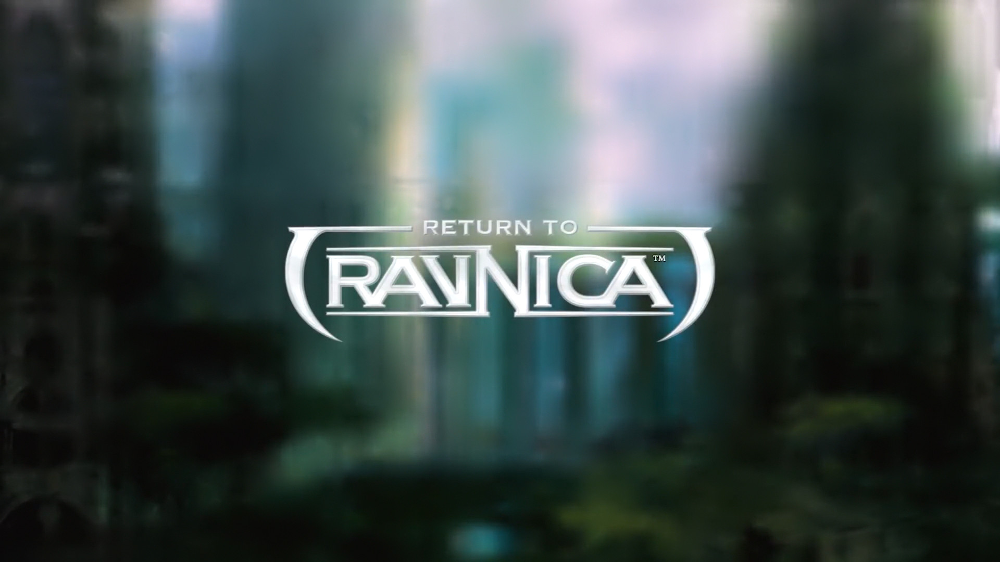
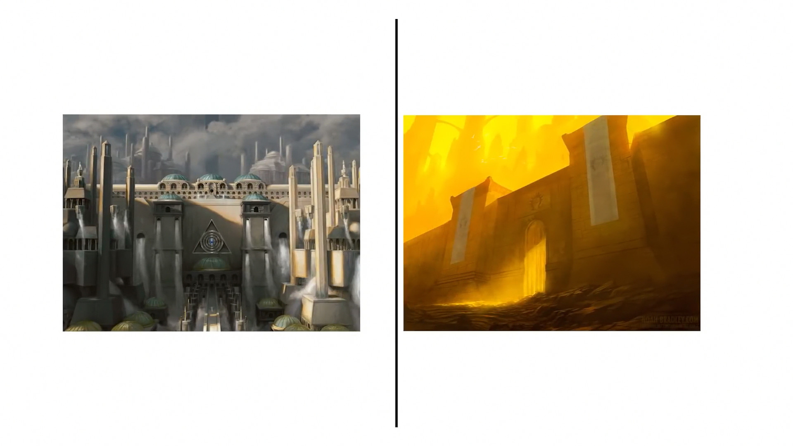
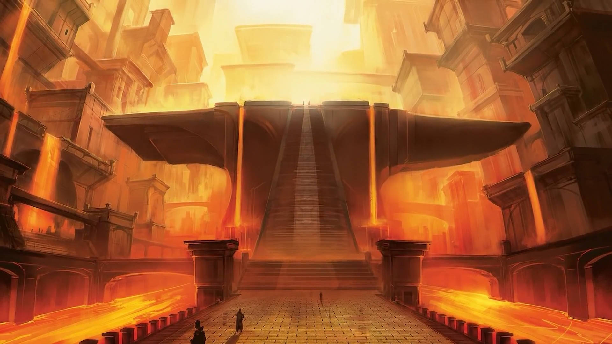

>尽管忽必烈可汗对马可波罗所描述的、旅途中所见的城市景象半信半疑，
>但这位鞑靼人的皇帝仍然拿出了比对以往任何一位信使或冒险家都更专注和好奇的态度。
>皇帝的一生里，在感受过开拓无限的疆土带来的骄傲之后，总会有那么一刻因无法理解领土的方方面面而感到沮丧和解脱。

这一段来自对Italo Calvino的实验性小说《看不见的城市》的介绍的文字给我对拉尼卡思考定下了基调。
在这些故事的框型结构叙事中，有两个角色占据了主要地位：日渐苍老的忽必烈可汗，以及一个受命讲述可汗领土上全部城市的旅行商人，马可波罗。
这些轶事的大多数都来自这位威尼斯人的旅行记。
马可波罗向忽必烈可汗描述了无数的奇景，然而在小说过半的时候，
我们得知马可波罗并不是在描述可汗领土上的不同城市，而是再一遍又一遍的描述威尼斯。
每一座新的城市都是从另一个角度对威尼斯的阐述。

拉尼卡，和Calvino的威尼斯一样，是无法用一种说法来准确定位的。
就像马可波罗的故事一样，这一位面是百万个缩影的异常重合。
对它的居民来说，拉尼卡是多种形态并存的。对玩家来说，拉尼卡还要更加易变。
你我在这座城市中的体验也许相似，但永远都不会一致。
卡牌游戏天生自带的非线性和随机性，让和这个世界的邂逅彼此间不尽相同。
因此，拉尼卡本身就是一座看不见的城市，一个有着大概的边界，却没有完美定义的舞台。
就像威尼斯一样，每次造访都会改变你的看法。
今天我想把目光投向让拉尼卡如此难以捉摸的各个元素，及其整体的存在。
上次我重点阐述了不同的颜色是如何在背景中创造身份认同和情绪的，这次我想阐述的是城市本身，那占据了卡面主体的奇幻生物们身后的城市。
我想强调一下世界构建背后所需要的努力，以及它们对插画的影响。
这些建筑结构常被忽略，所以我想慢慢地，分析它们在构建图像时所起到的作用。
更重要的是，我对把城市自己作为一种地点、一种想法和一个角色这一想法很感兴趣。

# 拉尼卡的建筑

2016年，Mike Linnemann 发表了一篇题为 《依尼翠的建筑》的文章，在里面他列出了所有用于参考的现实建筑。
创意团队就是在这些建筑的基础之上进行再创造，构建了广受爱戴的哥特恐怖式的位面。
和很多他其他的文章一样，Mike抛出了“你想在你的幻想中参杂多少现实？”这一问题。

在我第一次读到这一问题之后，我就在不断思考它，受其激发进行了研究和思考，并最终创作出了这个视频。
拉尼卡和依尼翠类似，都是和我们的世界相接，并给其附上魔幻色彩的一类背景。
我们可以在日常生活中找到它们的原材料，这类材料架起了幻想和现实的桥梁，帮助我们想想在那个位面上的生活。
而那个位面，具体来说，是被魔法的旋律点缀的、中世纪和文艺复兴时期的布拉格。

作为一个整体，欧洲富有的大量奇幻形象让它成为创造世界、雕琢故事的卓越起点和用于挖掘创造的完美原型。
它历经了数个世纪的的艺术和建筑发展；它一直是历代君王征服的目标，还是14世纪神圣罗马帝国皇帝查理四世的出生地。
二战期间，布拉格也是德国的占领区，在那之后成了旅游和工作的首选地、一座富裕的城市。
每一个新的政治文化发展都会带来的新的建筑。
从这个角度来看，走在布拉格或者任何欧洲主要城市的街道上，就像漫步在开放式的博物馆一样。
那么，为了把布拉格一样的城市转化成拉尼卡，创意团队在丛生的概念设定里研究了什么，又讨论了什么呢？

我又找来了万智牌画师Titus Lunter来提提供一些见解：

>我叫Titus Lunter，我的工作是插画师，主要为万智牌和威世智工作，从2010年开始就在构建世界了。
>拉尼卡可以说是吸收了欧洲建筑学600年来的精华。我们选用了最酷的门，最酷的拱道，把他们和最酷的窗户组合在一起，创造了一种有些糟糕的融合，建筑的“弗兰肯斯坦的怪物”。
>在这之后我们删减掉了不需要的部分，并整合进了一种流行风格。
>我认为这就是拉尼卡的独特之处，那种不独属于任何风格的拉尼卡建筑，那些房屋，尖塔和所见的各种东西。

Titus是负责2018年推出的《峰会（公会）拉尼卡》的创意团队中的成员。
该系列标志着对这座公会之城的第三次造访。
他的团队能利用上之前两个系列建立的全部视觉信息：足足1200张卡和大量在那之后诞生的机械和设计理论。

然而在2005年，拉尼卡首次亮相的时候，世界的创造者们并没有能用于参考的支点。
他们需要从零来建立整座城市。
我知道拉尼卡现在和十大公会是同义词，但我此时想强调一下的是：仅仅通过把万智牌带到了都市中心，初代系列就成了多么离经叛道的存在。

万智牌，在核心和起源上就是一个关于资源的游戏。
整个游戏机制都建立在五种基本地和他们代表的颜色之上。
正如我在先前的视频里说过的一样，初代拉尼卡系列成功把这些颜色互相组合的10种方式概念化了，
但这也逆反了基本地的概念，和将法术力视作自然环境产物的思想。

在2005年之前，每个万智牌系列都是以托尔金风的古典奇幻为源头，来给创造设计寻求灵感的。
所有的基本地都回应了这一思路，它们将自然作为展现美和力量的象征。
这10年来，海岛，山脉，树林，沼泽和平原都代表着乡下景观，国家公园以及对天涯海角的浪漫想象。

2003年推出的《秘罗地》系列是对这一传统的第一次打破，但几年后的拉尼卡彻底重新定义了基本地的概念。
把巫师和哥布林带到一个文艺复兴风的城市背景里是在传统之墙上留下的一道裂痕。
拉尼卡视觉上而言是反魔法的，其基本地也体现了这种转变。
画师不再为红色法术力绘制现实意义上的山脉，而是需要去捕捉Jeremy Cranford所称的基本山脉的精华。

为了让概念设计师们能更好的了解在初代系列重现这一理念的方法，他带着团队在华盛顿的周边地点进行了实地考察。
在瑞尼尔山附近的旅行和对西雅图地下城的探索，都帮助了他的团队改良城市背景之下的自然的含义。

给各种颜色制作的共20张基本地是为拉尼卡建立视觉身份的起点。
在这些卡牌之上，我们能清晰感受到他们本就该产生的魔法能量的存在；

沼泽就像是西雅图的地下城一样，雾蒙蒙的，染着一层绿色；
山脉则像画师们在实地旅行时看到的铸造厂一样，彰显激烈的红色；
海岛则坐落于水坝带来的瀑布从之间；树林也理所当然的盖满树林；
而平原则展现了日光之下城市风光的开阔景象。

通过这些基本地，玩家彻底的明白这一系列打破传统、重新发明奇幻世界这一概念的意图。
这种背景上的激进转变也体现在了原始系列的人气卡片“天堂鸟”上。

在2005年的时候，这个生物就已经成了万智牌历史上的标志性的一章，在很多核心系列里频频出现，并在《第七版》里迎来了新卡面。
在前两代，这种鸟明显栖息于热带环境，但在拉尼卡里，这种鸟则和背景里耸立的哥特教堂形成了完全的对比。
“很久以前，只要抬头张望就能看到天堂鸟。但由于城市规模的不断扩展，现在天堂鸟已经成为社会精英才拥有的宠物。”引自“天堂鸟”的背景叙述。
这张卡回应的是那种，每当有新的郊区规划、摩天楼取代公园、田野时，我们或许会有的无端焦虑。

所以，在宣传里，在基本地里，在那张备受关注又有些怀乡情感的卡上，城市的存在都是很明显的。
然而浏览最初系列的整个图库，拉尼卡的第一代仍然处在建立身份的过程之中。
有太多卡要么仅仅是对城市有所暗示，要么完全避开了城市。
画师只要把他们的描绘主体和地面上的建筑材料相交互，就可以避开描绘如此错综复杂的建筑物。例如“腐肉嚎狼”、“看守狼”以及“奉还”身后的巨大石块都是拉尼卡建筑的主体。“法庭轻骑兵”四周低厚的拱顶也无需他物，就可以让我们置身于城市之中。但在 “灵佑法师”以及“守护者法印”这些卡上，我们仍在用古典奇幻美学的方式进行构图。
这些卡看上去更像是2005年前后永无止境故事的迭代。

但在 “灵佑法师”以及“守护者法印”这些卡上，我们仍在用古典奇幻美学的方式进行构图。
这些卡看上去更像是2005年前后永无止境故事的迭代。

刃爪小恶魔展示了城市在构图上的引导能力。
锋利的爪刃，荷兰式斜角镜头，直指天空的尖塔和正空袭受害者的小恶魔方向恰恰相反，这一切都提供了一种动感。
其单色的背景也强化了优雅和丑陋之间的对比。

“控驭心灵” 向我们展示了覆盖拉尼卡各处的个体教堂的一角，
而“局部地动”则让我们看到了尖塔，拉尼卡的构成元素之一，未来系列中拉尼卡的决定性特征。

整体来看，对拉尼卡的初次造访是在寻求一个用于后续发展的地基。
其中缺乏相称的世界构建，而城市本身更像是背景板，而不是独立的角色。

7年之后，《再访拉尼卡》将这些问题从源解决了。

在2012年的九月，艺术总监JeremyJarvis发表了一篇名为《再访拉尼卡的风貌》的文章。
在这篇分为两部分文章里，Jarvis描述了他和他的概念设计师团队升级峰会之城的视觉身份的过程。
他写道：

>“为了迎接队伍的到来，我们打印出了原版拉尼卡系列里全部的风格指南和每一张卡面，把他们贴到墙上，
>标记出我们觉得方向正确但需要稍微推动一下的卡片，以及需要视觉上的完全重定向的那些。”

除开对公会符号本身的重新设计，拉尼卡另一个需要重做的重要元素是它的建筑物。
文章里很清楚的写明了Jarvis希望不同公会的建筑独特且和彼此不同，同时和他们代表的哲学相统一。
为了做到这一点，Jarvis带来了前途光明的概念设计师Sam Burley作为建筑方面的专家，本着这一精神，我想我也该为本视频做一样的事情。
于是我找来了我的好兄弟Eric Zidarich来讲讲建筑。

>好的，呃，我叫Eric Zidarich，我住在威斯康星州的密尔沃基，我毕业于Notre Dame大学的建筑专业。
>Notre Dame大学的建筑专业非常注重古典和传统建筑学，而不是现当代的风格。
>现在我为密尔沃基本地的高端建筑公司 工作。

我的第一个目标是处理那些将俄佐立的建筑和波洛斯建筑分开的小细节。
这两个公会在他们的意识形态上有不少的重叠之处，但在贯彻他们理想的手段上则有巨大的分歧。
回到Jarvis的文章，俄佐立的建筑理念是以秩序为重，它迫使人们排列整齐，被法律的重量压制。
Jarvis想要的是一个图书馆和车管所的混血。

这张画展示了一种对圆的强调以及一个让其居民牢牢处在适在之处的低拱门。
法律审判容不下动摇的余地，而他们的建筑强化了这一思想。
Eric在这个公会的建筑里看到了罗马式建筑的余韵： 

哥特式之前的建筑风格被称为罗马式。
这种风格代表着很多厚墙，圆顶拱门而非尖顶拱门，以及支撑建筑的矮粗圆柱。
所以这是种非常坚固的建筑，有些缺乏光亮，通风，深处内部会有一种压迫感。

除了最完备且易于自我维持的三角形装饰以外，俄佐立也让圆屋顶发挥了巨大的作用。
如果拉尼卡的特征是尖塔，那相反的存在就会是将一切的运动固定在地表的有顶建筑。

>当文艺复兴时代的建筑风格走入巴洛克时代，圆因为其过于静态的属性而被抛弃了。
>而在这里你可以找到和尖塔对比的圆顶，
>尖塔是如此的高耸且有煽动性，而这样一来，圆顶就有种池塘中的石头的感觉：
>它们只是在那里，不会移动，而且成功的渲染了一种排队等待的感觉：
>你将永远留在这里，这些圆顶将永远留在这里，你也是如此。

虽然和俄佐立一样对压迫感兴趣，但波洛斯采用的是更加物理性的方法。
他们是这座城市的军事单位，而他们的建筑也反映了他们想强加到平原住民身上的秩序。

一个简单的问题是，波洛斯建筑的究竟象征着什么？波洛斯的理念是什么？
他们想让你因他们的存在而感到安全，但是不是以一种父亲般的友好的方式。
他们所采用的是一种压迫的方式，但他们不会一开始就对你承认这一点，
所以我们在寻找的是一种“力量，但带有统治性的暗示”的象征。

如果说俄佐立的建筑有罗马式的风韵，那在我看来，波洛斯像是野性主义。
作为主要材料的水泥具有的冰冷和不为所动的气质，
以及结构带来的强烈重量感，体现了一种混合的征服感。
野性主义不是闹着玩的，它存在的意义是彰显建筑的核心目的，即提供坚实的庇护所。

这种感觉是从何而来的呢？  从印象塑造的角度来说，力量往往代表着平衡。
我明确知道重量应有的平衡；我知道竖直上要营造一种统治感，我们需要一个常被仰视的建筑，所以你能看到那些陡峭的垂直外观；
我也知道对此应该用一些水平元素加以抵消，所以要有一个非常牢固的基座，要证明我们所有的不是轻率的力量，而是立足于此的稳固力量。
基于同样的理由，我们也需要展现地平面，所以我加上了开阔的步行大道。
这也是再说这个建筑是可以访问的，那里有一条进去的路，而不是彻底，额，阻塞住的。
你明显是可以自由进出的，但你一进去，就会意识到自己在这伟大力量的阴影之下。

奥佐夫集团也同样和强大的力量相联系，不过是以完全相反的方式。
如果野性主义代表着一种只剩下核心元素的建筑，那前几个世纪的哥特风运动就单纯旨在探索建筑物的装饰性潜力，以及装饰对进入者的影响。
奥佐夫代表着奢华，他们通过探索和犯罪活动迎来了财富，
他们的建筑也旨在彰显他们庞大的灰色收入。

>哥特式建筑一个很酷的地方是，它可以说是被统治者创造的建筑风格。
>这些统治者、法国人他们掌握了大量的权力，他们想到：“我们需要建造一些能彰显我们权利和财富的建筑！”
>于是他们开始建造教堂了。

基本上欧洲所有受到天主教冲击的城市都在中心的哪里有一座教堂。
飞扶壁的发明带来了更薄的墙壁，以及安装窗户的可能性。
花窗玻璃在这之后成为了不识字的教徒理解圣经里主要事件的方式，也给建筑里带来了更多光亮。
事实上，进入哥特教堂是能感到强烈的通风感和振奋的，它本就应该是一种和天堂沟通的、令人赞叹的中转站。

奥佐夫的教堂也体现了同样的观点。
再根据Jarvis的文章，我们最后把建筑物变成了过于夸张、华而不实的教堂。
天花板和拱顶高得没有任何实际意义，还装点了成片的花窗玻璃。
奥佐夫的噱头就是无意义的高天花板和拱顶，再配上常人大小的门。

得益于幻想世界的灵活性，画师们也可以把花窗玻璃作为一种可塑材料或者装饰使用。
来自最初拉尼卡系列的“翠鸟彩釉”利用了这种纹路，并给它赋予了鸟的形态；
来自《兵临古城》的“欧佐瓦赋礼”也采用了类似的思路，它常被认为是这一系列里最受玩家欢迎的卡。
2019年，随着《火花之战》的公布，其宣传片彻底拥抱了这一想法。

旅法师（鹏洛客）们，这些游戏里的超级英雄，成为了教堂膜拜的对象。
他们的形象被恭敬的展现在花窗玻璃之中，成为了讲故事的工具，正如那些哥特教堂里的玻璃一样。

和哥特式美学相结合的是中世纪风的拉铎司建筑，这类建筑将火焰般绚丽的风格和他们对痛苦的痴迷建立了联系。
对拉铎司来说，人生就是一场马戏。

他们的建筑也回应了（他们的）核心真理，其建筑所用的形状语言充斥着恶魔般的意向，
他们的拱顶永远高的能让暴动之王本人随时加入他们的演出。
红光和黑色图像是他们的主题，Eric选用了“拉铎司公会门”作为他们风格色调的代表性卡片。

我注意到拉铎司的很多建筑都在往中世纪，城堡式以及炮门垛口的方向靠拢，而不是那种庞大的哥特式方向。
图像中所有的东西都有种鹅卵石的质感。
我更多的感觉是，他们可能也是处在建筑风格的中间点，而不像其他建筑物那样进行了更加激进的处理。
拉铎司是那种“兄弟，我们最懂这种地下城的阴险气氛，我们喜欢这个，要留在这里”的感觉。

吸引到Eric的更激进的公会之一自然是析米克联合，在这个公会身上我们可以看到建筑风格最多样化的融合。
他们发掘利用了几个世纪的建筑学发展，对我来说，最能代表现代世界中布拉格的存在。
它们还带有20世纪初出现的、高度装饰性的新艺术运动的主题。
这一运动的先锋，或许是其中最著名的艺术家阿尔方斯·穆夏被颂扬在布拉格中心的圣维特大教堂的彩色玻璃上。
析米克，就像穆夏一样，对繁荣、美和将生物学作为美学的激励源头抱有兴趣。

我认为析米克会有他们自己的子类别，即脱胎于生物形态的建筑本体和建筑之内的更加数学化的设计。
他们是风格的大杂烩，而这种风格某程度上反映了他们对待自己生物，变种人和士兵的方式，就是说那种是实验性的，把所有东西合在一起的倾向。
这个公会的建筑是非常非常有趣的，因为它真的有欧洲城市的感觉。
沿街走，你能看到一种风格紧挨着一种风格又紧挨着另一种风格，这种时间跨度上不同风格的混合带来了那种有趣的感觉。

此外，明显前景和背景也是截然不同的，但我认为这只是在表明析米克公会的大杂烩风格，生物和其他所有东西都是混合的。
这副图里，虽然各个建筑是迥异的，但作为整体来说，图像本身是种合成物。

Jenn Ravenna的“滋生之地”也是析米克理念的典型具象。

    我觉得这张卡真的拿捏到了那种新艺术运动的感觉。
    它仍然是有秩序的，你可以看到这里有一系列的拱门，
    不过这些拱门的细节要比其他任何建筑，不管是哥特的还是罗马的又或者是文艺复兴时期的建筑都要大为不同，
    但就算是这样，形式的秩序还在那里，虽然细节的已经遗失了。
    还有，这个建筑物让我想到了高迪的作品。

那么，在建筑方面，析米克是最实验性的，也因此是最梦幻的。
他们发展自己设计的过程不需要和我们世界的交互。
通过这种方式，他们也许代表了一种前往未来的路，以及对未来的一个世纪内城市生活的潜力的思考。
此外，这一想法让我想到了关于拉尼卡的最后一点。

就像Eric和Titus之前说过的，拉尼卡是人类几个世纪的发展浓缩在幻想虚像中的样子，
这是一座冲突的理念可以共存，允许在属于自己的区域里尽情展现生活理念的城市。
公会是这些理念的投影，他们通过大幅简化的设定（simplified tropes）来明确理念上的分歧，
但我通过这个视频所想表达的是：
“建筑，也可以交流理念”他们虽然浅薄和装饰性的存在，但也可以作为故事叙述的一部分和表明身份的图腾。

而且幻想故事一直以来，都在某种程度上是在想象遥远的过去或者真实的未来里的生活。
拉尼卡的建筑物和我的分析探索了光谱的左右两个极端。
通过这些卡片，我们可以回顾一个非常真实的人类历史，
踏足另一个宇宙并思考一些当下困扰我们的棘手问题。
其中一个问题是：
千年之后，我们的城市会变成什么样子？
剩下的四个公会给出了一些答案。

葛加理认为一切都会变成废墟。他们代表着从恩典之中的初次坠落，认为最终自然将吞噬一切。
Stephan Bella Dean的“蔓生墓园”是这思想的体现。

它展示了一个被藤蔓和苔藓覆盖的、带有圆顶和尖拱门的典型拉尼卡建筑。
它深处地下，也许处在拉尼卡的某个主要下水管线之旁，讲述了一个以时间为度量的故事。

其他的卡片，比如Vulcan Baga的葛加理长足虫则认为生命可以继续存在，并在地下世界繁荣。
也许人类社会可以找到无需太阳也可以生存的办法。
《生化危机》系列中的浣熊市也采用过这种思想，
不过葛加理的方式似乎在暗示堕落的文明将滋生某种可怖的存在。

瑟雷尼亚则处在硬币的反面，他们大部分的建筑都利用了某个古代城市的残垣。
他们同样相信生命的苏生以及自然世界和人造世界的共生关系。
瑟雷尼亚的卡面展现了一个更加光明充满希望的未来，他们把过去的错误变成有纪念意义的发展新起点。
裂缝里成长的树木并不是碍眼的东西，而是新建筑的中心，是该被保存乃至崇拜的存在。
如果自然要颠覆整个水泥世界，那瑟雷尼亚就将把它当作一种积极、甚至也可说是装饰性的力量。

他们的另一方向的极端则是完全机械化的工业废土伊捷联盟。
我在之前的视频里说过那是魔法版的《银翼杀手》。
这世界中自由奔腾的河流、树林的痕迹都已经完全消失，取之而代是发展到极致的城市景观。
我想他们会觉得纽约市的地铁系统自在如家，毕竟那里也满是全机械化环境的副产品——污垢和灰尘。
伊捷认为，如果世界真的要完全被工业覆盖，生命也仍然会全力冲锋。

这样一来， 就只剩下最后一个需要考虑的公会了。

我想用这张图片来给之前所有对建筑功能和城市身份的思考做个总结。
这是Alexander Forssberg所绘的“古鲁公会门”。如果葛加理代表着文明的第一次崩坏，
那么瑟雷尼亚就代表终将到来的重建和与废墟的和谐共存，
而古鲁就代表着一切崩倒的时刻。

视频的最开始我就说过，万智牌核心上是个关于资源的游戏。
一切都环绕着基本地的理念展开。
拉尼卡踏足城市中心，探索了发达世界的各个方面，
但古鲁坚定的拥护回归田园。
他们是自然的使者，他们想要让文明想起它的起源，并侵略式的扫清一切脱离了起源的建筑。

这张图片是完美的，它简洁，易于理解，引人发笑。
它传递了一种对都市扩展的深远抵抗，并提醒我们自然本身就是最强大的力量。
火把是一种反拉尼卡的存在，它呼应的是旧时代奇幻《龙与地下城》的美学。
门四周塌倒的石块让人想起公会之城的主要建材，门上古鲁的血涂鸦也适得其所。
这其实说不上是公会门，而更像是一声回归原始的战嚎。食物，庇护所，土地，这就是动物本能的精华。

我将以Calvino小说中的最后一个想法结束。
在凝视这些本质的景观之时，忽必烈想到了维持城市的无形秩序，
裁定城市兴起、成形和繁荣的规则，
城市适应各种季节的方法，以及它们最终融入并倒在废墟之中的样子。 

# 译后

 - 来自评论区，作者解释了没有提到底密尔会堂的原因 -
以防有人好奇，底密尔会堂占据了城市的全域，他们的建筑是多种我提到的元素的融合。
他们的角色是动态的，在所有空间中移动，他们的公会门也像是建筑和建筑这件的隐藏通道。
每个区域都，在一定程度上，属于这些阴险的间谍和刺客。
如果想更深入的理解底密尔，我高度推荐Groucho Marco的视频：https://youtu.be/Ai7wQNk7dO4

# 鸣谢

atr